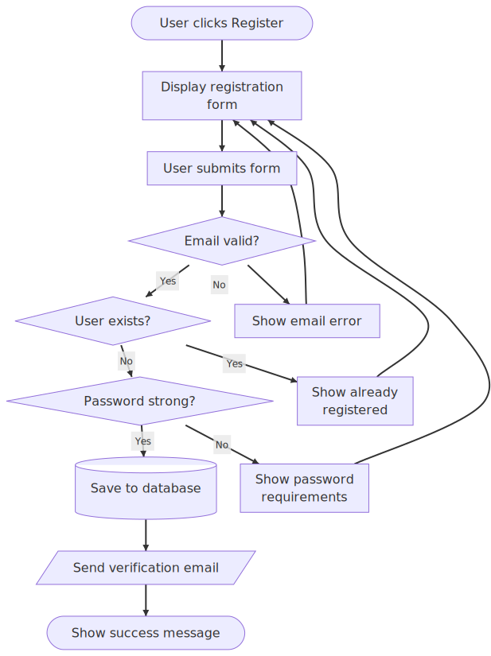

# merm

Pure Python Mermaid diagram renderer. Converts Mermaid markup to SVG with zero JavaScript dependencies.

## Install

```bash
pip install merm
```

## Usage

### Command line

```bash
# File to file
merm -i diagram.mmd -o diagram.svg

# Pipe
echo 'graph LR
    A --> B --> C' | merm > diagram.svg

# With uvx (no install needed)
uvx merm -i diagram.mmd -o diagram.svg
```

### Python API

```python
from merm import render_diagram

svg = render_diagram("""
flowchart TD
    A[Start] --> B{Decision}
    B -->|Yes| C[OK]
    B -->|No| D[End]
""")
```

## Examples

### Flowchart with Font Awesome icons

```
flowchart TD
    A[fa:fa-tree Christmas Tree] --> B[fa:fa-gift Presents]
    A --> C[fa:fa-star Star on Top]
    B --> D[fa:fa-car Drive to Grandma]
    C --> E[fa:fa-lightbulb Lights]
    D --> F[fa:fa-home Grandma's House]
    E --> F
```


### Registration flow

```
flowchart TD
    Start([User clicks Register]) --> Form[Display registration form]
    Form --> Submit[User submits form]
    Submit --> ValidateEmail{Email valid?}
    ValidateEmail -->|No| EmailError[Show email error]
    EmailError --> Form
    ValidateEmail -->|Yes| CheckExists{User exists?}
    CheckExists -->|Yes| ExistsError[Show already registered]
    ExistsError --> Form
    CheckExists -->|No| ValidatePassword{Password strong?}
    ValidatePassword -->|No| PasswordError[Show password requirements]
    PasswordError --> Form
    ValidatePassword -->|Yes| CreateUser[(Save to database)]
    CreateUser --> SendEmail[/Send verification email/]
    SendEmail --> Success([Show success message])
```



## Supported diagram types

- Flowchart (`graph` / `flowchart`) — all directions (TD, LR, BT, RL), subgraphs, shapes, edge labels
- Sequence (`sequenceDiagram`) — participants, messages, loops, alt/opt/par fragments
- Class (`classDiagram`) — classes, methods, attributes, relationships
- State (`stateDiagram`) — states, transitions, composite states, forks/joins

## Features

- Pure Python — no Node.js, no browser, no Puppeteer
- ~200x faster than mermaid-cli (mmdc)
- SVG output with clean markup
- All flowchart shapes and edge types
- Subgraph nesting and styling
- Edge labels and arrow markers
- Font Awesome icons

## Performance

Benchmarked against mermaid-cli (mmdc) across 28 scenarios:

| | merm | mmdc |
|---|---|---|
| Average render time | ~1 ms | ~200 ms |
| Dependencies | 0 | Node.js + Puppeteer |
| Startup overhead | None | ~500 ms |

## License

WTFPL
