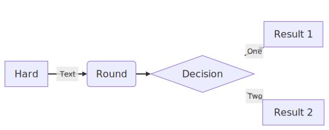
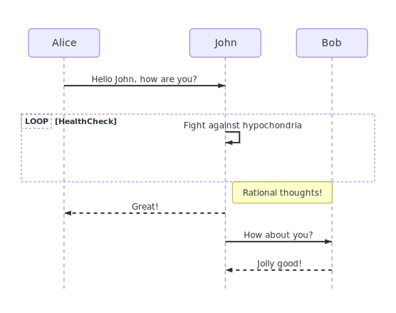
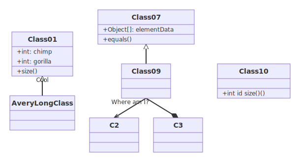
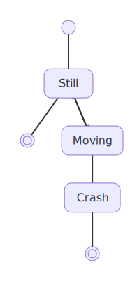
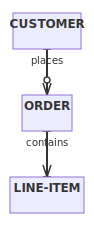
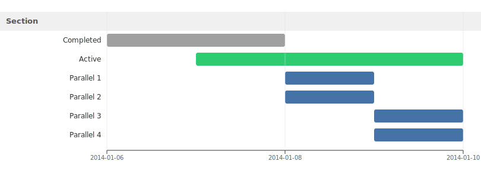
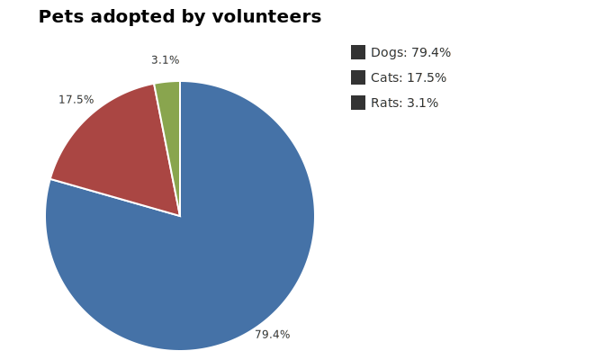
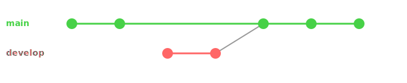
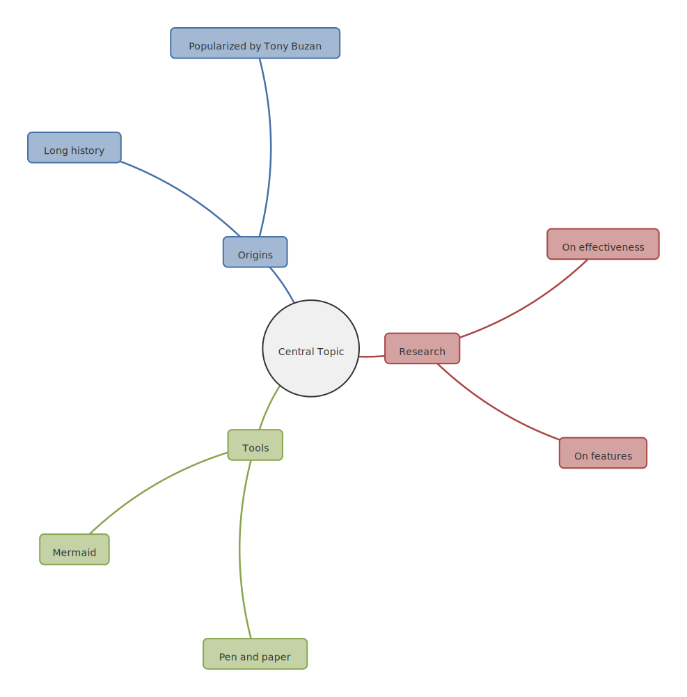

# merm

Pure Python Mermaid diagram renderer. Converts Mermaid markup to SVG with zero JavaScript dependencies.

## Install

```bash
pip install merm
```

## Usage

### Command line

```bash
# File to file (SVG)
merm diagram.mmd -o diagram.svg

# PNG output
merm diagram.mmd -o diagram.png

# Pipe
echo 'graph LR
    A --> B --> C' | merm > diagram.svg

# With a theme
merm diagram.mmd --theme dark -o diagram.svg

# With uvx (no install needed)
uvx merm diagram.mmd -o diagram.svg
```

### Python API

```python
from merm import render_diagram, render_to_file, render_to_png

# Render to SVG string
svg = render_diagram("""
flowchart TD
    A[Start] --> B{Decision}
    B -->|Yes| C[OK]
    B -->|No| D[End]
""")

# Render directly to file (format auto-detected from extension)
render_to_file("flowchart TD\n    A --> B", "diagram.svg")
render_to_file("flowchart TD\n    A --> B", "diagram.png")

# Render to PNG bytes
png_bytes = render_to_png("flowchart TD\n    A --> B")

# With a theme
svg = render_diagram("flowchart TD\n    A --> B", theme="dark")
```

## Supported diagram types

All examples below are rendered by merm. Browse all 131 rendered examples in [docs/examples/](docs/examples/).

### Flowchart

```
flowchart LR
    A[Hard] -->|Text| B(Round)
    B --> C{Decision}
    C -->|One| D[Result 1]
    C -->|Two| E[Result 2]
```



### Sequence diagram

```
sequenceDiagram
    Alice->>John: Hello John, how are you?
    loop HealthCheck
        John->>John: Fight against hypochondria
    end
    Note right of John: Rational thoughts!
    John-->>Alice: Great!
    John->>Bob: How about you?
    Bob-->>John: Jolly good!
```



### Class diagram

```
classDiagram
    Class01 <|-- AveryLongClass : Cool
    Class09 --> C2 : Where am I?
    Class09 --* C3
    Class09 --|> Class07
    Class07 : equals()
    Class07 : Object[] elementData
    Class01 : size()
    Class01 : int chimp
    Class01 : int gorilla
    class Class10 {
        int id
        size()
    }
```



### State diagram

```
stateDiagram-v2
    [*] --> Still
    Still --> [*]
    Still --> Moving
    Moving --> Still
    Moving --> Crash
    Crash --> [*]
```



### Entity relationship diagram

```
erDiagram
    CUSTOMER ||--o{ ORDER : places
    ORDER ||--|{ LINE-ITEM : contains
    CUSTOMER }|..|{ DELIVERY-ADDRESS : uses
```



### Gantt chart

```
gantt
    section Section
    Completed :done, des1, 2014-01-06, 2014-01-08
    Active :active, des2, 2014-01-07, 3d
    Parallel 1 : des3, after des1, 1d
    Parallel 2 : des4, after des1, 1d
    Parallel 3 : des5, after des3, 1d
    Parallel 4 : des6, after des4, 1d
```



### Pie chart

```
pie
    "Dogs" : 386
    "Cats" : 85.9
    "Rats" : 15
```



### Git graph

```
gitGraph
    commit
    commit
    branch develop
    checkout develop
    commit
    commit
    checkout main
    merge develop
    commit
    commit
```



### Mindmap

```
mindmap
  root((Central Topic))
    Origins
      Long history
      Popularized by Tony Buzan
    Research
      On effectiveness
      On features
    Tools
      Pen and paper
      Mermaid
```



### Flowchart with Font Awesome icons

```
flowchart TD
    A[fa:fa-tree Christmas Tree] --> B[fa:fa-gift Presents]
    A --> C[fa:fa-star Star on Top]
    B --> D[fa:fa-car Drive to Grandma]
    C --> E[fa:fa-lightbulb Lights]
    D --> F[fa:fa-home Grandma's House]
    E --> F
```


## Features

- Pure Python — no Node.js, no browser, no Puppeteer
- ~200x faster than mermaid-cli (mmdc)
- SVG and PNG output
- 4 built-in themes: default, dark, forest, neutral
- Theme directives: `%%{init: {'theme': 'dark'}}%%`
- 9 diagram types: flowchart, sequence, class, state, ER, gantt, pie, mindmap, gitgraph
- All flowchart shapes and edge types
- Subgraph nesting and styling
- Edge labels and arrow markers
- Font Awesome icons
- CLI tool with stdin/stdout piping

## Performance

Benchmarked against mermaid-cli (mmdc) across 28 scenarios:

| | merm | mmdc |
|---|---|---|
| Average render time | ~1 ms | ~200 ms |
| Dependencies | 0 | Node.js + Puppeteer |
| Startup overhead | None | ~500 ms |

## License

WTFPL
