# Rendered Examples Gallery

All 132 examples rendered by merm.

## Basic

### Diamond

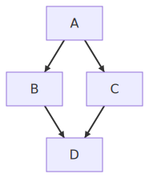

### Fan In

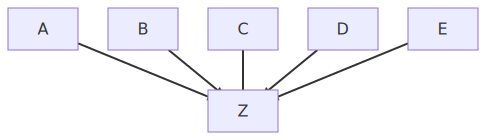

### Fan Out

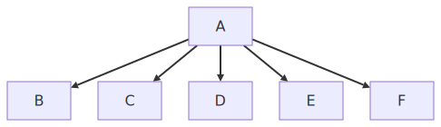

### Linear Chain

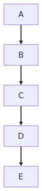

### Parallel Paths

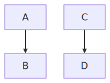

### Self Loop

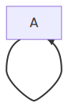

### Single Node

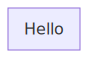

### Two Nodes

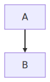

## Class

### All Relationships

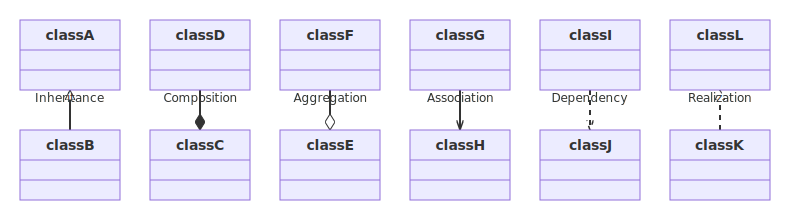

### Annotations

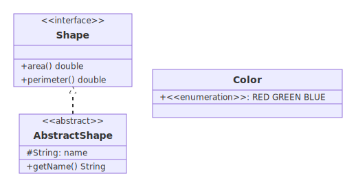

### Basic

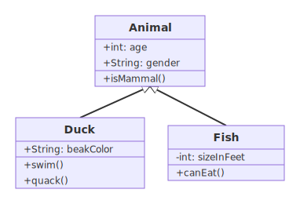

### Cardinality

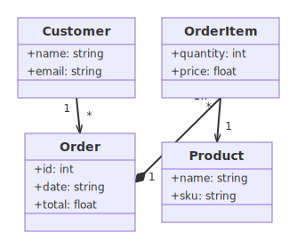

### Complex

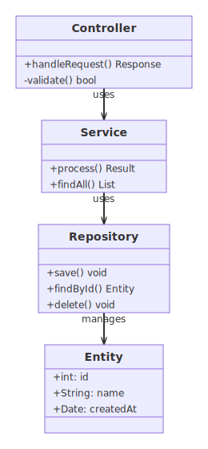

### Inheritance

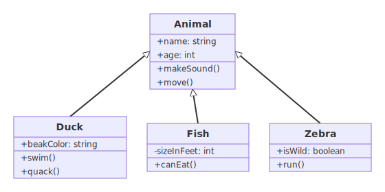

### Interface Realization

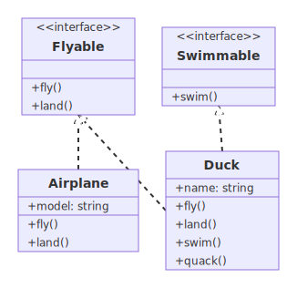

### Many Members

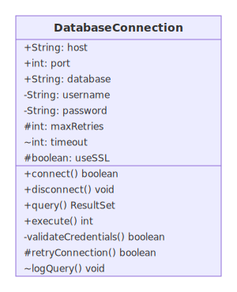

### Members

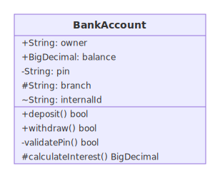

### Mermaid Readme

### Relationships

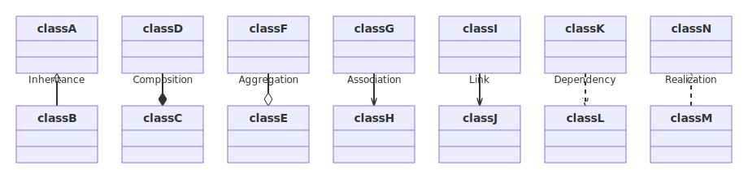

## Direction

### Bt

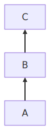

### Lr

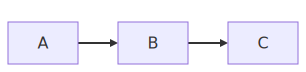

### Rl

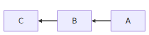

### Tb

### Td

## Edges

### Arrow

### Circle Endpoint

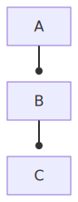

### Cross Endpoint

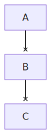

### Dotted

### Invisible

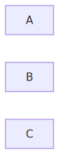

### Labeled Edges

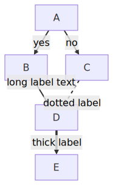

### Open Link

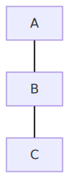

### Thick

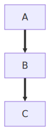

## Er

### All Cardinalities

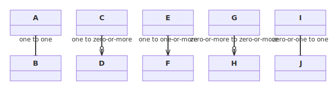

### Attributes

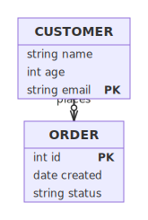

### Basic

### Complex

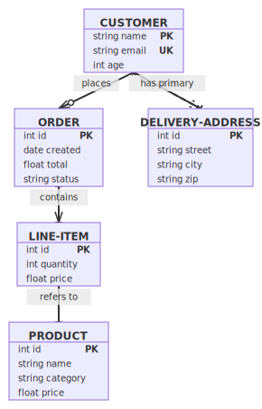

### Dashed Lines

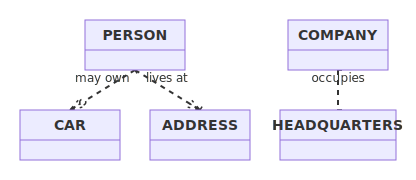

## Flowchart

### Api Request

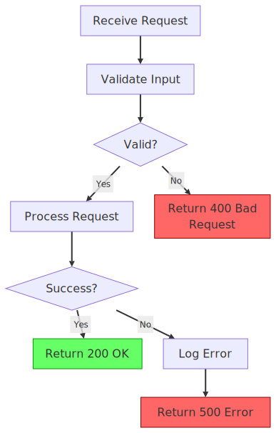

### Ci Pipeline

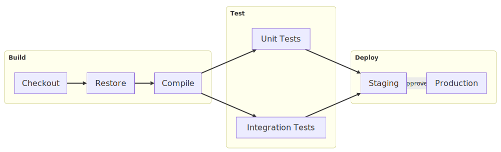

### Coffee Machine

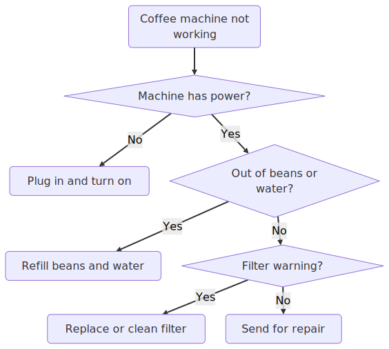

### Debug Loop

### Elt Bigquery

### Emoji

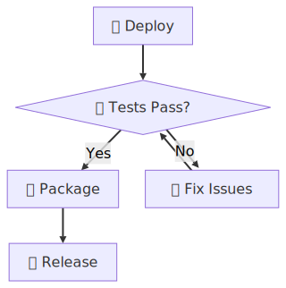

### Emoji Workflow

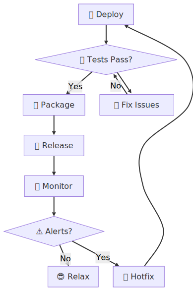

### Etl Postgres

### Etl Simple

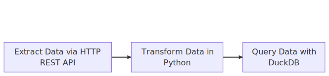

### Icons

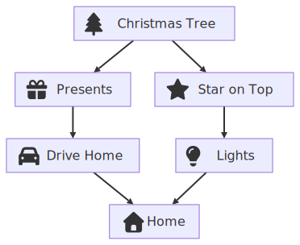

### Mermaid Readme

### Registration

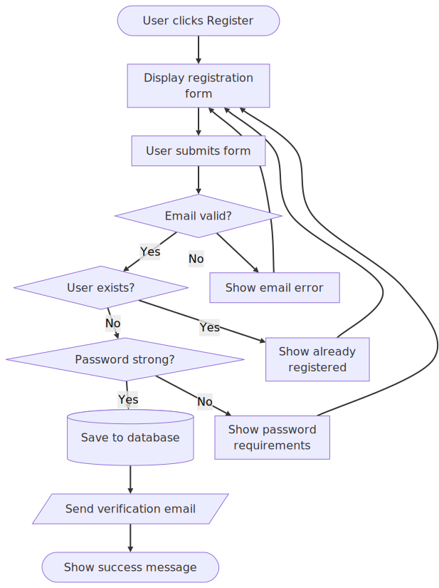

## Gantt

### Basic

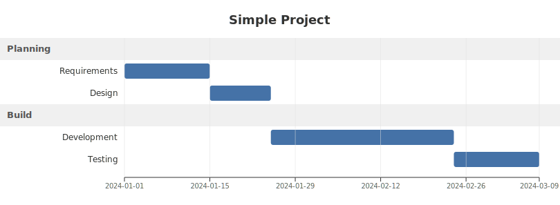

### Mermaid Readme

### Modifiers

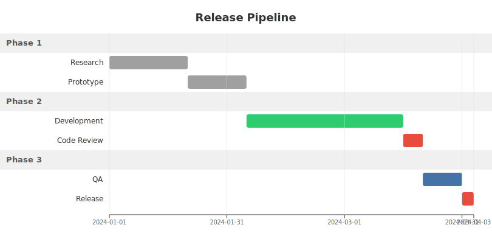

### No Title

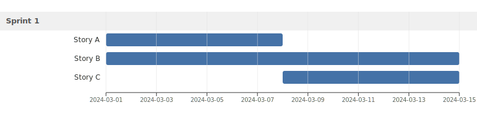

### Single Section

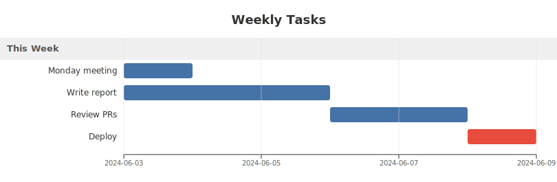

## Gitgraph

### Basic

### Branching

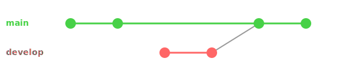

### Cherry Pick

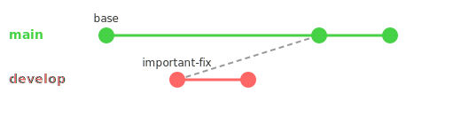

### Complex

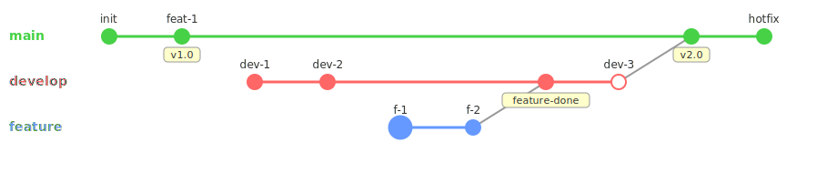

### Mermaid Readme

## Github

### Api Request

### Ci Pipeline

### Coffee Machine

### Debug Loop

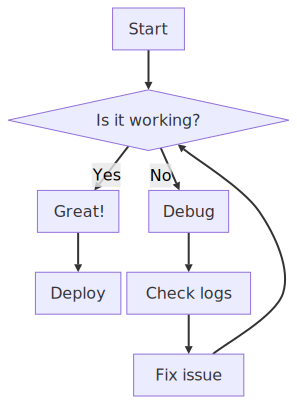

### Elt Bigquery

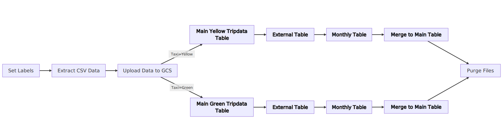

### Emoji Workflow

### Etl Postgres

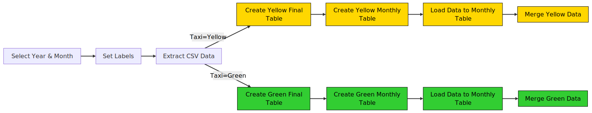

### Etl Simple

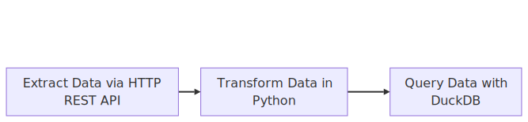

### Flink Late Event

### Flink Late Upsert

### Rag Pipeline

### Registration

### Xmas Tree

## Mindmap

### Basic

### Deep Tree

### Mermaid Readme

### Shapes

### Single Root

## Pie

### Basic

### Many Slices

### Mermaid Readme

### No Title

### Show Data

### Single Slice

## Scale

### Large

### Medium

### Small

## Sequence

### Activations

### Arrows

### Basic

### Complex

### Flink Late Event

### Flink Late Upsert

### Loops

### Mermaid Readme

### Notes

## Shapes

### Asymmetric

### Circle

### Cylinder

### Diamond

### Double Circle

### Hexagon

### Mixed Shapes

### Parallelogram

### Parallelogram Alt

### Rect

### Rounded

### Stadium

### Subroutine

### Trapezoid

### Trapezoid Alt

## State

### Basic

### Choice

### Complex

### Fork Join

### Mermaid Readme

### Nested

## Styling

### Classdef Multiple

### Classdef Single

### Default Class

### Inline Style

### Mixed Styled Unstyled

## Subgraphs

### Cross Boundary Edges

### Nested Subgraphs

### Sibling Subgraphs

### Single Subgraph

### Subgraph Direction

### Subgraph With Title

## Text

### Long Text

### Multiline

### Quoted Labels

### Short Text

### Special Chars

