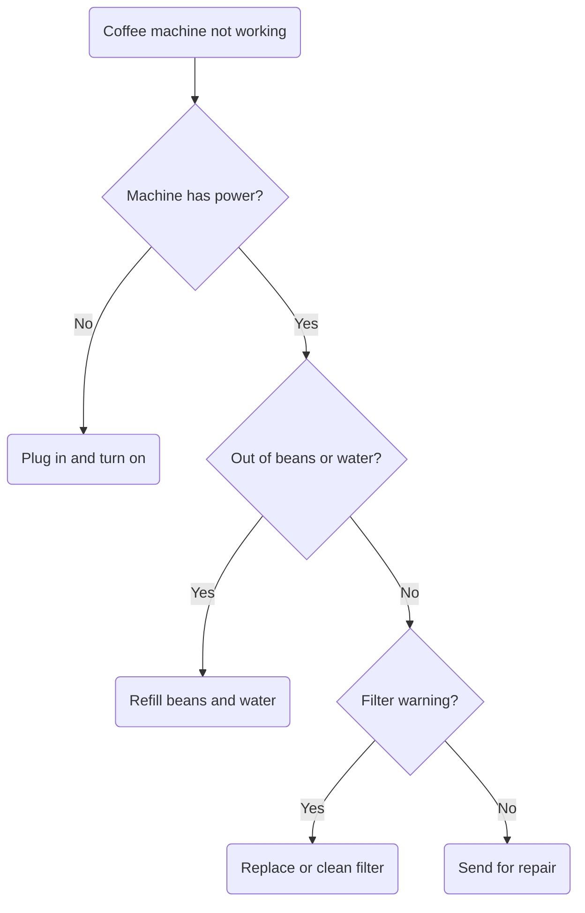

# Task 32: Fix Text Clipping Outside SVG Viewport

## Problem

Node labels that are positioned near the top or edges of the diagram get clipped or rendered outside the SVG viewBox. This makes text appear floating at the top of the diagram, disconnected from its node.

### Reproduction

Node A "Coffee machine not working" text is clipped at the top of the SVG. Node C "Out of beans or water?" diamond renders with no text inside — text floats above.

### Root Cause

The viewBox calculation doesn't account for all text bounding boxes. Long text in rounded `()` or diamond `{}` shapes overflows the shape bounds, and the viewBox clips it.

## Acceptance Criteria

- [ ] All node labels are fully visible within the SVG viewport
- [ ] Text in `()` rounded nodes does not overflow outside the shape
- [ ] Text in `{}` diamond nodes is fully contained within the diamond
- [ ] The viewBox expands to include all rendered text
- [ ] The coffee machine diagram above renders with all labels readable
- [ ] `uv run pytest` passes with no regressions

## Test Scenarios

### Unit: ViewBox includes text bounds
- Render a diagram with long text in a rounded node, verify all text is within viewBox
- Render a diagram with long text in a diamond, verify text is inside the diamond shape

### Visual: Real-world diagrams
- Coffee machine diagram: all 7 node labels fully visible
- API request diagram: "Return 400 Bad Request" text fully visible inside its red box

## Dependencies
- None (can be done independently)
