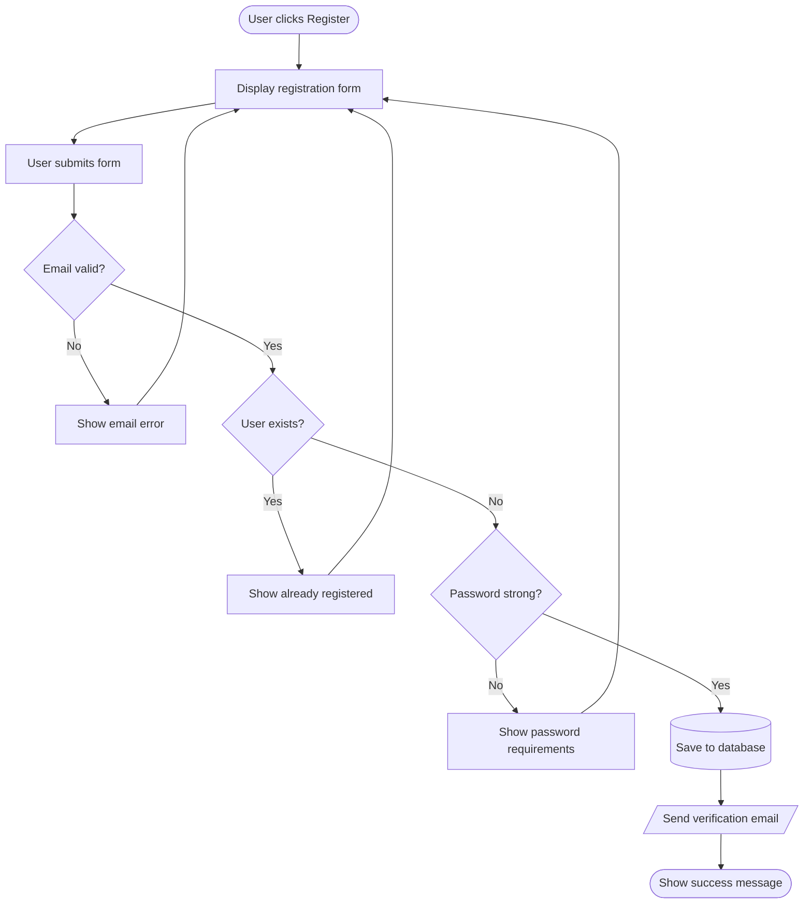

# Task 34: Fix Back-Edge Routing for Cycles and Multiple Return Edges

## Problem

When multiple edges go backwards (from a lower node to a higher node, creating cycles), the back-edge curves overlap and create a tangled mess. This is especially bad when multiple error paths return to the same node.

### Reproduction

Three edges (EmailError->Form, ExistsError->Form, PasswordError->Form) all go back up to "Form". They overlap into an unreadable bundle of curves on the right side.

### Root Cause

In `src/pymermaid/layout/sugiyama.py`, back-edges (edges reversed during `_remove_cycles`) are laid out through dummy nodes that all occupy the same x-coordinate channel. When the reversed points are flipped back in `_route_edges` (line 517-519), the resulting polylines overlap because the dummy nodes for different back-edges were placed at the same horizontal position within each layer. There is no logic to spread multiple back-edges horizontally when they share the same target.

### Current Visual Evidence

- **registration.mmd**: The three back-edge curves (EmailError->Form, ExistsError->Form, PasswordError->Form) run through a near-identical vertical channel on the right side, making them indistinguishable.
- **debug_loop.mmd**: Single back-edge (Fix issue->Is it working?) routes acceptably but uses a wide sweep -- could benefit from tighter routing.

## Scope

Modify the Sugiyama layout algorithm so that multiple back-edges sharing the same target (or routing through the same layers) are given distinct horizontal offsets, producing visually separated curves. The fix should be in the layout phase (dummy node positioning or a post-layout back-edge offset pass), NOT in the SVG renderer.

Key files:
- `src/pymermaid/layout/sugiyama.py` -- `_route_edges`, `_assign_coordinates`, and/or `_insert_dummy_nodes`

Out of scope:
- Self-loops (handled separately in task 24/38)
- Edge label positioning (task 28)
- Orthogonal edge routing (future enhancement)

## Acceptance Criteria

- [ ] `from pymermaid import render_diagram` renders `tests/fixtures/github/registration.mmd` with all 3 back-edges (EmailError->Form, ExistsError->Form, PasswordError->Form) having visually distinct paths -- no two back-edge polylines share the same x-coordinates for their intermediate waypoints
- [ ] `tests/fixtures/github/debug_loop.mmd` renders with the single back-edge (Fix issue->Is it working?) routing cleanly around the right side of the diagram without crossing through any node bounding boxes
- [ ] Back-edge dummy nodes for different back-edges that pass through the same layer are assigned different x-positions (horizontal offset of at least 20px between adjacent back-edge channels)
- [ ] For a graph with N back-edges sharing the same target, the back-edge channels are spread evenly (not all stacked on one side)
- [ ] Back-edges do not cross through the bounding boxes of unrelated nodes
- [ ] PNG verification: render `registration.mmd` to PNG at `/tmp/task34_registration.png` -- the three return-to-Form curves must be individually traceable (not a single thick overlapping line)
- [ ] PNG verification: render `debug_loop.mmd` to PNG at `/tmp/task34_debug_loop.png` -- the back-edge curve is clean and does not overlap with forward edges
- [ ] `uv run pytest` passes with no regressions
- [ ] No changes to `src/pymermaid/render/edges.py` beyond what is strictly necessary (the fix should be in the layout, not the renderer)

## Test Scenarios

### Unit: Back-edge dummy node separation
- Create a graph with 2 back-edges targeting the same node (e.g., `A->B->C->A` and `A->B->D->A`). After layout, verify that the dummy nodes for these two back-edges have different x-coordinates in every shared layer.
- Create a graph with 3 back-edges targeting the same node (the registration pattern). Verify that all three sets of dummy node x-positions are distinct.
- Create a graph with back-edges targeting different nodes. Verify that they don't interfere with each other's routing.

### Unit: Back-edge polyline geometry
- For `registration.mmd`, extract the `EdgeLayout.points` for the three back-edges. Verify that no two back-edges share intermediate waypoints (points between source and target must differ by at least 15px on the x-axis).
- For `debug_loop.mmd`, extract the `EdgeLayout.points` for the back-edge (Fix issue->Is it working?). Verify that none of the intermediate waypoints fall inside any node's bounding box.

### Unit: Regression -- forward edges unaffected
- Render `tests/fixtures/corpus/basic/linear_chain.mmd` (no cycles). Verify the layout is unchanged from before the fix (same node positions, same edge points).
- Render `tests/fixtures/corpus/basic/diamond.mmd` (no cycles). Verify no regressions.

### Visual: Registration flow
- Render `registration.mmd` to PNG. Visually confirm all 3 return-to-Form curves are separately traceable.

### Visual: Debug loop
- Render `debug_loop.mmd` to PNG. Visually confirm the back-edge does not overlap with any forward edges.

## Dependencies

- Task 06 (Sugiyama layout) -- done
- Task 09 (Edge renderers) -- done
- No blocking dependencies; this task can be worked independently

## Implementation Hints

The most natural approach is to add a post-positioning pass in `_assign_coordinates` or a new helper called from `layout_diagram` that:

1. Identifies which edges in `reversed_indices` share layers (i.e., their dummy node chains pass through the same layer indices).
2. Assigns a horizontal offset to each back-edge's dummy nodes, spacing them apart. For example, if 3 back-edges all pass through layer 3, place their dummy nodes at `x_right + offset * 1`, `x_right + offset * 2`, `x_right + offset * 3` where `x_right` is the rightmost real node in that layer.
3. The offset should be proportional to the number of back-edges (e.g., 30-40px per channel).

An alternative is to assign different "channels" on the right side of the diagram for each back-edge, similar to how mermaid.js routes them with distinct curvature.
