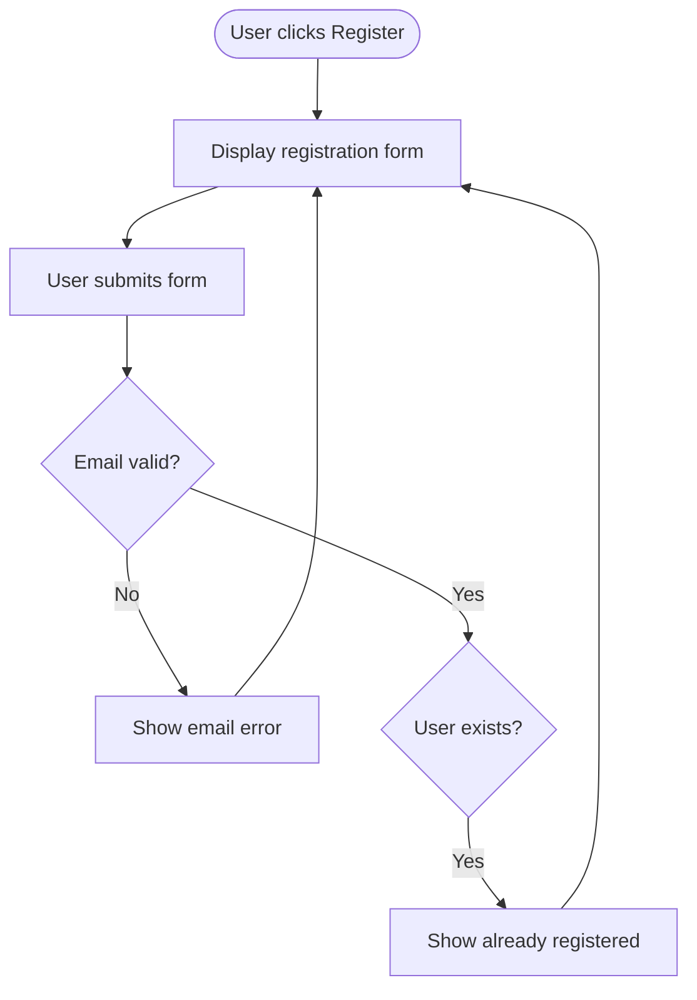

# Task 35: Fix Nodes Rendering With No Text (Empty Boxes)

## Problem

Some nodes render as empty shapes with no text inside. The shape is drawn correctly but the label text is missing or positioned outside the visible area of the shape.

### Reproduction

"Display registration form", "Show already registered" nodes render as empty rectangles. Their text appears floating at the top of the diagram instead of inside the node.

### Root Cause

The text positioning (x, y coordinates in the `<text>` SVG element) may be computed before the node position is finalized by the layout algorithm, or the text element is placed at the node's pre-layout position rather than its final position.

## Acceptance Criteria

- [ ] Every node that has a label renders the label text inside the node shape
- [ ] No `<text>` elements are positioned outside their parent node's bounding box
- [ ] No empty shapes appear in any rendered diagram
- [ ] The registration flow diagram renders with text in all 14 nodes
- [ ] `uv run pytest` passes with no regressions

## Test Scenarios

### Unit: Text inside node
- Render a 10-node diagram, parse SVG, verify each `<text>` element's x,y is within its node's shape bounds
- Render a diagram with mixed shapes (rect, diamond, rounded, stadium, cylinder), verify all have text

### Visual: Registration and API diagrams
- All nodes in registration flow have visible text
- "Return 400 Bad Request" in API diagram has text inside the red box

## Dependencies
- Task 32 (viewport clipping) — may be the same root cause
