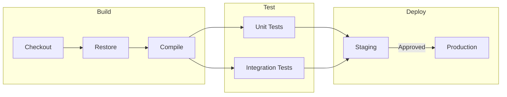

# Task 36: Fix LR Subgraph Layout (Overlapping Boundaries)

## Problem

In LR (left-to-right) flowcharts with multiple subgraphs, the subgraph boundaries overlap each other. Subgraphs should be laid out as separate visual regions, but instead they bleed into each other.

### Reproduction

"Build", "Test", and "Deploy" subgraphs overlap each other. The "Build" boundary extends into the "Test" and "Deploy" regions. Nodes from different subgraphs are not visually separated by their boundaries.

### Root Cause

The `_separate_subgraphs` function in `src/pymermaid/layout/sugiyama.py` (line ~736) only separates sibling subgraphs along the **Y axis** (vertical/rank axis in TB space). It sorts by `min_y` and pushes subgraphs down to prevent vertical overlap. However, it does not separate subgraphs along the **X axis** (the order axis in TB space).

When the direction is LR, the TB X-axis becomes the rendered Y-axis after the `_apply_direction` transform (which swaps x and y). This means sibling subgraphs whose nodes share the same ranks but are at different positions along the order axis will have overlapping bounding boxes in the final LR render.

The fix must ensure that `_separate_subgraphs` (or a new companion function) also separates sibling subgraphs along the X axis in TB space (which corresponds to the Y axis in LR/RL renders), so that subgraph bounding boxes do not overlap in either dimension after the direction transform.

### Verified Current State (PNG evidence)

- `/tmp/ci_pipeline_lr.png` -- Build/Test/Deploy all overlap. Build extends rightward into Test area, Deploy extends leftward.
- `/tmp/shared_layer_lr.png` -- GroupA and GroupB overlap when nodes from different subgraphs share the same layers.
- `/tmp/simple_lr_subgraphs.png` -- 2 subgraphs in a linear chain: looks OK because nodes naturally separate by layer.
- `/tmp/rl_subgraphs.png` -- RL case: looks OK for a simple chain.
- `/tmp/nested_lr.png` -- Nested subgraphs in LR: looks OK when inner subgraphs are on different layers.

The overlap is most severe when sibling subgraphs have nodes that occupy the same TB layers (ranks), causing their bounding boxes to span the same Y range in TB space but different X ranges that the current code does not separate.

## Scope

This task is **only** about fixing subgraph boundary overlap in LR/RL layouts. It is not about:
- Changing node placement within subgraphs (beyond shifting to avoid overlap)
- Edge routing improvements (covered by other tasks)
- TB/BT subgraph overlap (the existing Y-axis separation handles TB/BT)
- Nested subgraph direction overrides (already works)

## Acceptance Criteria

- [ ] Sibling subgraphs in LR layout do not overlap each other -- their rendered bounding boxes have no intersection in either dimension
- [ ] Sibling subgraphs in RL layout do not overlap each other
- [ ] Each subgraph boundary fully contains all of its child nodes (no node extends outside its parent subgraph boundary)
- [ ] Subgraph titles are fully visible and not clipped by adjacent subgraph boundaries
- [ ] Cross-subgraph edges route between the boundaries without being hidden behind subgraph fills
- [ ] The CI pipeline diagram (Build/Test/Deploy) renders with 3 visually distinct, non-overlapping subgraph regions arranged left-to-right
- [ ] PNG verification: render `/tmp/ci_pipeline_lr_fixed.png` and confirm no bounding box overlap by inspection and by programmatic bbox check
- [ ] PNG verification: render `/tmp/shared_layer_lr_fixed.png` and confirm subgraphs with nodes on the same layers do not overlap
- [ ] `uv run pytest` passes with no regressions (existing tests in `tests/test_subgraph.py` and `tests/test_layout.py` still pass)
- [ ] TB and BT subgraph layouts are not degraded (no regressions for non-LR/RL diagrams)

## Test Scenarios

### Unit: LR subgraph bounding box separation (2 siblings)
- Render LR diagram with 2 sibling subgraphs whose nodes share the same layers
- Extract `SubgraphLayout` bounding boxes from the `LayoutResult`
- Assert: the bounding box rectangles do not overlap (no intersection of x-ranges AND y-ranges simultaneously)
- Assert: each subgraph's bounding box fully contains all its child `NodeLayout` rectangles

### Unit: LR subgraph bounding box separation (3 siblings)
- Render the CI pipeline diagram (Build, Test, Deploy) with direction LR
- Extract `SubgraphLayout` bounding boxes for all 3 subgraphs
- Assert: no pair of bounding boxes overlaps
- Assert: all 3 subgraph titles have y-coordinates above their content area and within their bounding box

### Unit: RL subgraph bounding box separation
- Render RL diagram with 3 sibling subgraphs (Output, Processing, Input)
- Assert: no pair of bounding boxes overlaps

### Unit: TB/BT regression check
- Render the existing `tests/fixtures/subgraphs.mmd` (TB direction)
- Assert: subgraph bounding boxes do not overlap (should still work as before)

### Unit: Nested subgraphs in LR
- Render LR diagram with an outer subgraph containing 2 inner subgraphs
- Assert: inner subgraph bounding boxes do not overlap
- Assert: outer subgraph bounding box fully contains both inner bounding boxes

### Visual: CI pipeline PNG
- Render the CI pipeline to PNG
- Visually confirm: "Build", "Test", "Deploy" are 3 distinct non-overlapping regions
- Visually confirm: all edges between subgraphs are visible and route cleanly

### Visual: Shared-layer subgraphs PNG
- Render the shared-layer test case (GroupA, GroupB with nodes on same layers) to PNG
- Visually confirm: GroupA and GroupB do not overlap

## Implementation Hints

The key file is `src/pymermaid/layout/sugiyama.py`. The `_separate_subgraphs` function (line ~728) currently only separates along the Y axis. It needs to also separate along the X axis. One approach:

1. In `_separate_siblings`, after sorting by `min_y` and pushing down, also sort by `min_x` and push right to eliminate X-axis overlap.
2. Alternatively, detect which axis matters more based on the subgraph node distribution (if subgraphs are side-by-side vs stacked).
3. Be careful with the order of separation -- separating on one axis may create new overlaps on the other. May need iterative passes or a smarter strategy.

The separation must happen **before** `_apply_direction` is called (it currently does, at line ~1137), because `_apply_direction` swaps axes for LR/RL.

## Dependencies

- Task 26 (horizontal direction layout LR/RL) -- done
- Task 10 (subgraph support) -- done
