# Theme Gallery

merm ships with four built-in themes: **default**, **dark**, **forest**, and **neutral**.

Below you can preview each theme applied to the same flowchart, sequence diagram, and class diagram.

## Default

The default theme uses purple nodes on a white background, matching mermaid.js defaults.

| Flowchart | Sequence | Class |
|-----------|----------|-------|
| 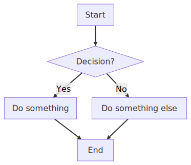 | 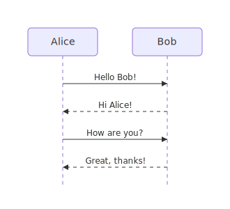 | 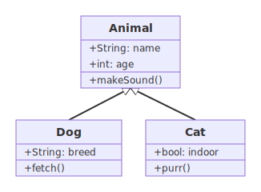 |

## Dark

Dark background with light text and blue-tinted nodes.

| Flowchart | Sequence | Class |
|-----------|----------|-------|
| 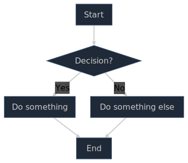 | 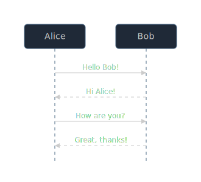 | 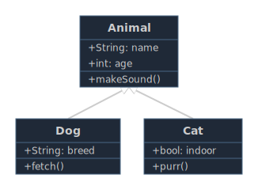 |

## Forest

Green-tinted nodes with dark green edges on a white background.

| Flowchart | Sequence | Class |
|-----------|----------|-------|
| 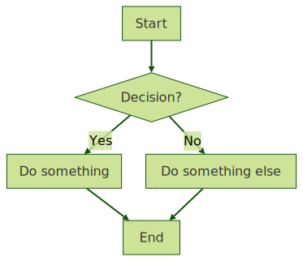 | 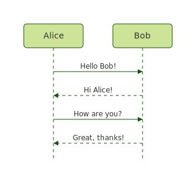 | 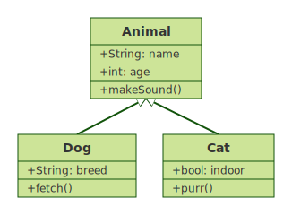 |

## Neutral

Greyscale nodes with neutral edges, suitable for print or minimal UIs.

| Flowchart | Sequence | Class |
|-----------|----------|-------|
| 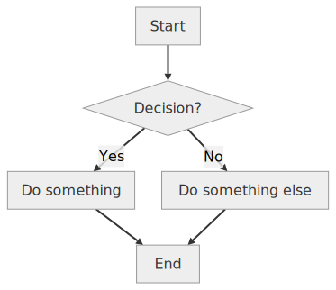 | 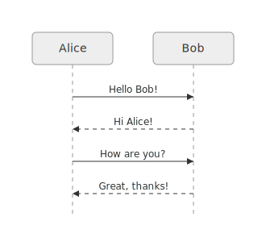 | 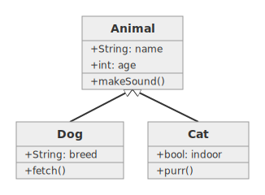 |

## Usage

### Python API

```python
from merm import render_diagram

# Pass theme by name
svg = render_diagram(source, theme="dark")

# Or use a Theme object for customization
from merm.theme import get_theme

theme = get_theme("forest")
svg = render_diagram(source, theme=theme)
```

### CLI

```bash
# Render with a specific theme
merm input.mmd -o output.svg --theme dark

# The default theme is used when --theme is omitted
merm input.mmd -o output.svg
```

### Init directive

You can also set the theme inside the diagram source using a mermaid.js-compatible init directive:

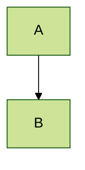

An explicit `theme` argument (API or CLI) always overrides the init directive.

## Regenerating the gallery

To regenerate the SVG images after modifying themes:

```bash
uv run scripts/generate_theme_gallery.py
```
