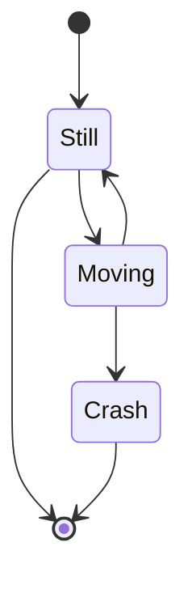

# Issue 69: State diagram arrows don't touch circles and routing issues

## Problem

Multiple arrow rendering issues in state diagrams:

1. Arrows don't touch the start `[*]` and end `[*]` circle nodes — there's a gap
2. The arrow between "Still" and "Moving" has a weird/broken path

## Reproduction

## Expected

- Arrow tips should connect cleanly to circle boundaries
- All arrow paths should be smooth and natural
