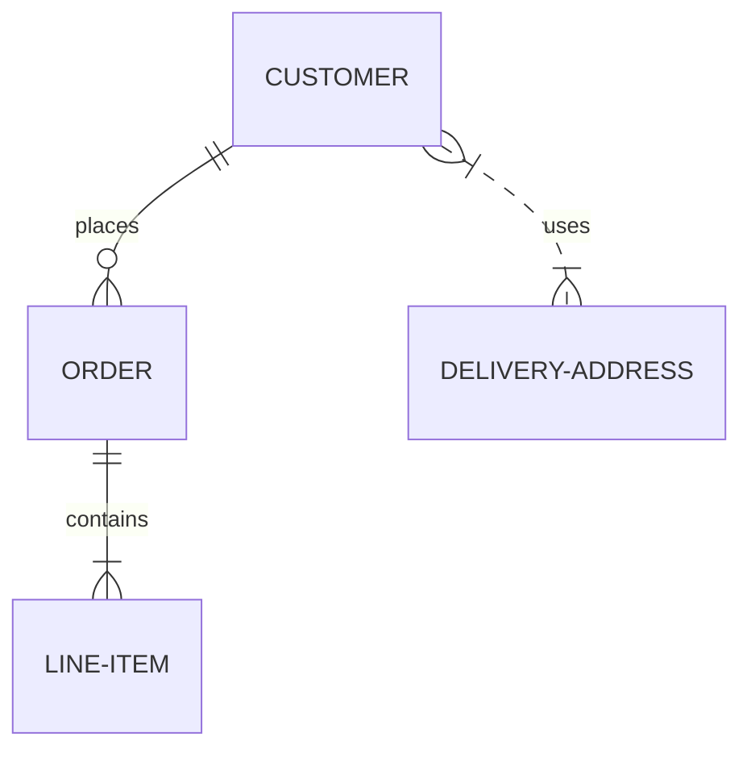

# Issue 70: ER diagram renders too large

## Problem

ER diagrams render at an excessively large scale — the overall diagram dimensions are much bigger than necessary.

## Reproduction

## Expected

Diagram should render at a reasonable, compact size similar to mmdc output.
