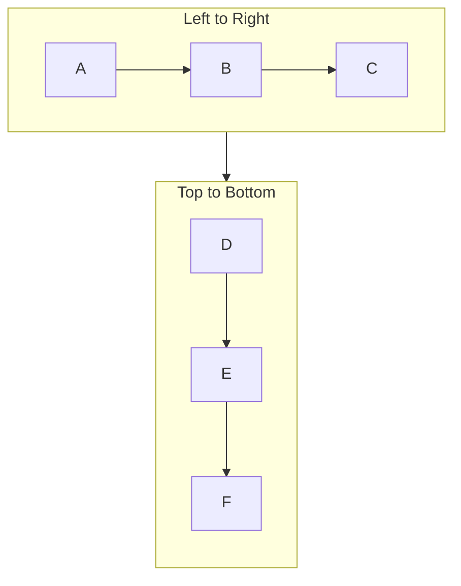

# Issue 78: Subgraph direction LR support

## Problem

The `direction LR` directive inside subgraphs is ignored. Nodes inside subgraphs always lay out top-to-bottom regardless of the specified direction.

## Reproduction

## Expected

Nodes inside `sub1` should be arranged left-to-right (A, B, C horizontally), while `sub2` remains top-to-bottom.

## Scope

- Parse and respect `direction` directive inside subgraphs
- Apply per-subgraph layout direction in the Sugiyama layout engine
- Support all directions: TB, TD, BT, RL, LR
