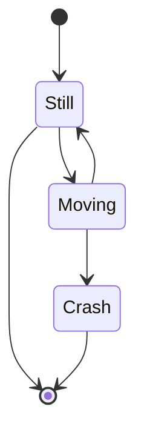

# Issue 88: Bidirectional edges overlap on same path

## Problem

When two nodes have edges in both directions (e.g., `Still --> Moving` and `Moving --> Still`), both edges are drawn on the exact same path. The two arrowheads collide at each end, making them look blunt or merged. Users cannot visually distinguish that there are two separate edges.

Reproduction: state diagram with `Still --> Moving` and `Moving --> Still`.

## Expected

Bidirectional edges should be drawn as two separate parallel paths with a small offset, so both arrows are clearly visible and distinguishable.

## Acceptance criteria

- When two nodes have edges in both directions, the edges must be drawn as separate parallel paths (not overlapping)
- Each arrowhead must be clearly visible and sharp
- The offset between parallel paths should be small (3-5px) — enough to distinguish but not distracting
- Single-direction edges must be unaffected (still drawn centered)
- Works for all diagram types that support bidirectional edges (flowchart, state)
- Existing tests must continue to pass
