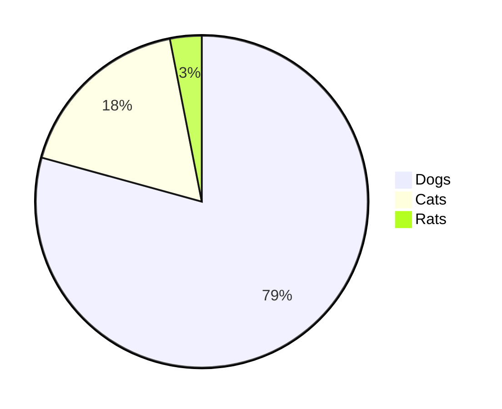

# Issue 89: Pie chart legend swatches show wrong color

## Problem

The color swatches in the pie chart legend are all dark/black squares instead of matching the actual slice colors. The pie slices themselves are correctly colored (blue, red, olive), but the legend rectangles don't reflect these colors.

Reproduction:

## Expected

Each legend swatch rectangle should be filled with the same color as its corresponding pie slice.

## Acceptance criteria

- Legend color swatches must match their corresponding pie slice colors
- All pie chart fixtures must render with correct legend colors
- Existing tests must continue to pass
