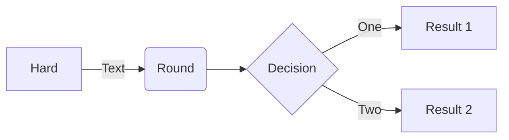
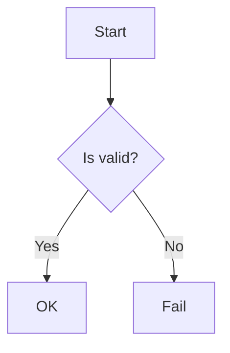

# Issue 67: Flowchart arrows don't touch diamond (decision) nodes

## Problem

In flowchart diagrams (all directions: LR, TD, etc.), arrows connecting to diamond/rhombus `{Decision}` nodes don't reach the node boundary. There is a visible gap between the arrowhead and the diamond shape.

## Reproduction

Also test with TD direction:

## Expected

Arrow tips should touch the diamond border, same as they touch rectangular and rounded nodes.

## Root Cause

The `_boundary_point()` function in `src/merm/layout/sugiyama.py` (line 580) computes edge endpoints using a **rectangular** bounding box intersection for ALL shapes, including diamonds. For a diamond with bounding box (w, h), the actual diamond vertices are at the midpoints of each side of the bounding box. A ray from the center to an angled target hits the diamond edge sooner than it hits the bounding rectangle, so the computed endpoint overshoots the diamond boundary, creating a gap.

The fix must either:
1. Make `_boundary_point()` shape-aware (accept a shape parameter and use diamond geometry when appropriate), or
2. Add a separate `_diamond_boundary_point()` function that uses `_ray_polygon_intersection()` from `src/merm/render/shapes.py` (or equivalent logic) to compute the intersection with the four diamond vertices, and call it when the source or target node has `NodeShape.diamond`.

The `DiamondRenderer.connection_point()` in `src/merm/render/shapes.py` already correctly computes diamond intersections via `_ray_polygon_intersection()` -- the layout just doesn't use it.

## Dependencies

None.

## Acceptance Criteria

- [ ] `_boundary_point()` or equivalent in `sugiyama.py` correctly computes edge endpoints for diamond-shaped nodes using diamond geometry (not rectangular bounding box)
- [ ] For a diamond node with bounding box (w, h), the computed edge endpoint lies on the diamond boundary (the polygon connecting the four midpoints of the bounding box sides)
- [ ] Edges entering a diamond from the left/right/top/bottom touch the diamond tip exactly (within 1px tolerance)
- [ ] Edges entering a diamond at an angle (e.g., 45 degrees) touch the diamond edge, not the bounding rectangle
- [ ] Rectangular, rounded, stadium, and other non-diamond shapes are NOT affected by this change (regression check)
- [ ] Self-loop edges on diamond nodes still render correctly
- [ ] The `_MARKER_SHORTEN` adjustment in `edges.py` still works correctly with diamond endpoints (arrowhead tip lands on diamond border, not the shortened path endpoint)
- [ ] `uv run pytest` passes with all existing tests plus new tests
- [ ] Render the reproduction diagrams (LR and TD) to PNG with cairosvg and visually verify that arrows touch the diamond border with no gap

## Test Scenarios

### Unit: Diamond boundary point computation
- Ray from diamond center going right (0 degrees) hits the right vertex (cx + w/2, cy)
- Ray from diamond center going down (90 degrees) hits the bottom vertex (cx, cy + h/2)
- Ray from diamond center going at 45 degrees hits the diamond edge (NOT the bounding rectangle corner)
- Ray from diamond center going left hits the left vertex
- Ray from diamond center going up hits the top vertex
- Verify the computed point lies on one of the four diamond edges (within floating-point tolerance)

### Unit: Edge routing with diamond nodes
- Edge from a rect node to a diamond node: target endpoint is on the diamond boundary
- Edge from a diamond node to a rect node: source endpoint is on the diamond boundary
- Edge between two diamond nodes: both endpoints are on diamond boundaries
- Vertical edge (TD) into a diamond: endpoint is at the top vertex
- Horizontal edge (LR) into a diamond: endpoint is at the right vertex (or left, depending on direction)

### Integration: Full diagram rendering
- Render the LR reproduction diagram, parse SVG, verify edge path endpoints are within 1px of diamond polygon edges
- Render the TD reproduction diagram, verify similarly
- Render a diagram with mixed shapes (rect, rounded, diamond), verify all edge endpoints are correct

### Regression: Non-diamond shapes unaffected
- Render a flowchart with only rect/rounded/stadium nodes, verify edge endpoints match previous behavior
- Compare SVG output for a non-diamond flowchart before and after the change (should be identical or negligibly different)

### Visual: PNG verification
- Render the LR reproduction diagram to PNG via cairosvg and visually confirm arrows touch diamond borders
- Render the TD reproduction diagram to PNG via cairosvg and visually confirm arrows touch diamond borders
- Compare with mmdc reference PNG if available
