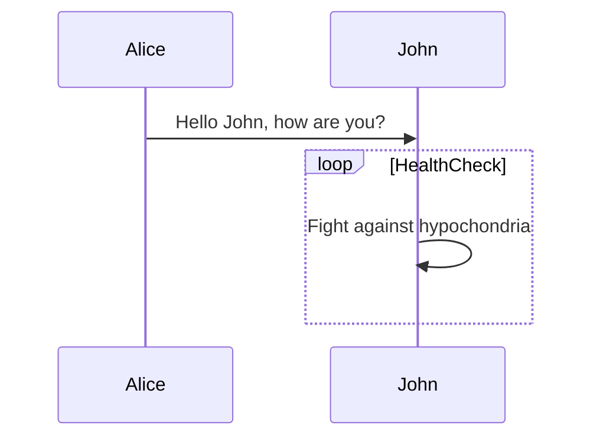
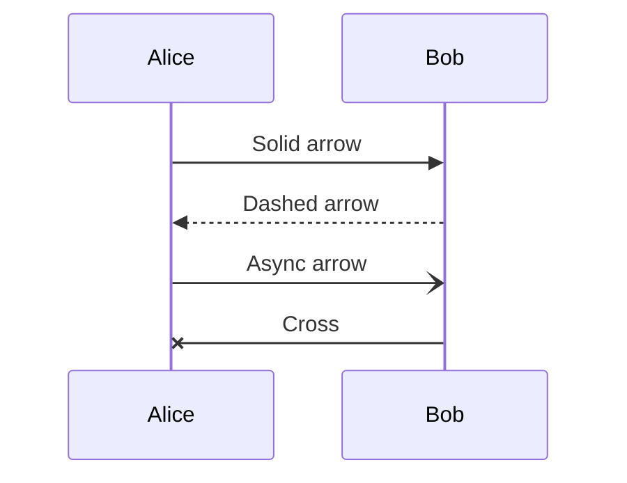

# Issue 68: Sequence diagram arrowheads too large

## Problem

In sequence diagrams, the arrowheads on message arrows are disproportionately large compared to the arrow lines and overall diagram scale. They look oversized and clunky compared to mmdc reference output.

## Reproduction

Also test with multiple message types:

## Expected

Arrowheads should be proportionally sized -- small and clean, similar to mmdc output. The arrowhead should be visually subordinate to the message text, not dominating it.

## Root Cause

In `src/merm/render/sequence.py`, the `_build_defs()` function defines sequence diagram markers with these dimensions:

- `seq-arrow`: `markerWidth="10"`, `markerHeight="7"` with polygon `"0 0, 10 3.5, 0 7"`
- `seq-arrow-open`: `markerWidth="10"`, `markerHeight="7"`
- `seq-cross`: `markerWidth="10"`, `markerHeight="10"`
- `seq-async`: `markerWidth="10"`, `markerHeight="7"`

All use `markerUnits="userSpaceOnUse"`, meaning the marker size is absolute in user units. With a stroke-width of 2px, a 10x7 arrowhead is too large relative to the line and text.

The fix should reduce the marker dimensions (both `markerWidth`/`markerHeight` and the internal polygon/polyline coordinates) to produce smaller, proportional arrowheads. Typical good proportions would be around 6x4 or 7x5 for the filled arrow, and similarly scaled for the open and async variants. The cross marker should also be reduced proportionally.

Note: the `refX`/`refY` values must be updated to match the new polygon geometry so the arrowhead tip still aligns with the line endpoint.

## Dependencies

None.

## Acceptance Criteria

- [ ] Sequence diagram `seq-arrow` marker dimensions are reduced from 10x7 to smaller proportional values (approximately 6-8 wide, 4-6 tall)
- [ ] The `seq-arrow-open` marker is similarly reduced
- [ ] The `seq-async` marker is similarly reduced
- [ ] The `seq-cross` marker is proportionally reduced
- [ ] `refX` and `refY` are updated to match the new geometry so arrowheads still align with line endpoints (no gap, no overshoot)
- [ ] The internal polygon/polyline coordinate paths are updated to match the new marker dimensions
- [ ] Arrowheads are visually smaller and proportional to the message lines and text in the rendered output
- [ ] Self-message arrows (e.g., `John->>John`) still render correctly with the smaller arrowheads
- [ ] All existing sequence diagram tests pass
- [ ] `uv run pytest` passes with all existing tests plus new tests
- [ ] Render the reproduction diagrams to PNG with cairosvg and visually verify arrowheads are proportionally sized

## Test Scenarios

### Unit: Marker definition dimensions
- Parse the SVG output for a sequence diagram and extract marker definitions
- Verify `seq-arrow` marker has `markerWidth` and `markerHeight` smaller than 10 and 7 respectively
- Verify `seq-arrow-open` marker has similarly reduced dimensions
- Verify `seq-async` marker has similarly reduced dimensions
- Verify `seq-cross` marker has reduced dimensions
- Verify all markers still have `markerUnits="userSpaceOnUse"`

### Unit: Marker geometry consistency
- Verify `seq-arrow` polygon points form a valid triangle within the marker viewBox
- Verify `refX` equals the x-coordinate of the arrowhead tip (so the tip aligns with the line end)
- Verify `refY` equals the vertical center of the marker (so the arrow is centered on the line)

### Integration: Full diagram rendering
- Render the basic reproduction diagram, verify SVG contains correctly-sized markers
- Render a diagram with all message types (solid, dashed, open, cross, async), verify all markers are present and correctly sized
- Render a self-message diagram, verify the self-loop arrow still connects properly

### Regression: No broken arrow alignment
- Render a sequence diagram and verify that arrowheads touch the line endpoints (no visible gap)
- Verify message text is not obscured by oversized arrowheads

### Visual: PNG verification
- Render the basic reproduction diagram to PNG via cairosvg and visually confirm arrowheads are small and proportional
- Render the multi-message-type diagram to PNG and visually confirm all arrow types look correct
- Compare arrowhead size relative to participant box text -- arrowheads should be clearly smaller than a text character
- Compare with mmdc reference PNG if available
