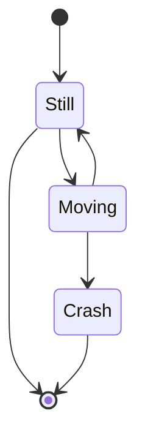

# Issue 69: State diagram arrows don't touch circles and routing issues

## Problem

Multiple arrow rendering issues in state diagrams:

1. Arrows don't touch the start `[*]` and end `[*]` circle nodes -- there's a gap
2. The arrow between "Still" and "Moving" has a weird/broken path

## Root Cause

In `src/merm/layout/statediag.py`, the `layout_state_diagram` function:

1. Runs Sugiyama layout with normal node sizes (text-based sizing via `measure_fn`)
2. The Sugiyama engine routes edge endpoints to these original node boundaries
3. Post-processes by shrinking start/end circles to 20x20px (`_START_END_SIZE = 20.0`)
4. But does NOT re-route edge endpoints to match the new smaller boundaries

This means edge endpoints still target the pre-shrink boundary positions, creating a visible gap between the arrow tip and the circle.

The weird routing between "Still" and "Moving" is likely caused by Catmull-Rom smoothing creating artifacts when intermediate waypoints are close together or when the Sugiyama layout places them at unfavorable positions.

## Reproduction

## Expected

- Arrow tips should connect cleanly to circle boundaries (start and end nodes)
- All arrow paths should be smooth and natural, with no kinks or weird detours

## Dependencies

None.

## Acceptance Criteria

- [ ] Arrows from `[*]` (start) connect to the black circle boundary with no visible gap
- [ ] Arrows to `[*]` (end) connect to the bull's-eye circle boundary with no visible gap
- [ ] The arrow between "Still" and "Moving" follows a smooth, natural path with no kinks
- [ ] All edges in the reproduction diagram route cleanly between their source and target
- [ ] Edge endpoint re-routing happens AFTER the start/end circle resize in `layout_state_diagram`
- [ ] Existing state diagram tests continue to pass (`uv run pytest tests/test_statediag.py`)
- [ ] Render the reproduction diagram to PNG with cairosvg and visually verify that arrows touch circles and paths are smooth
- [ ] Render `tests/fixtures/corpus/state/basic.mmd` to PNG and verify no regressions

## Test Scenarios

### Unit: Edge endpoints connect to resized start/end circles

- Parse and layout the reproduction diagram
- For each edge involving a start `[*]` node, verify the edge endpoint is within 2px of the circle boundary (center +/- radius)
- For each edge involving an end `[*]` node, verify the edge endpoint is within 2px of the circle boundary
- The gap between arrow tip and node boundary should be less than 2px (accounting for marker size)

### Unit: Edge routing produces smooth paths

- Parse and layout the reproduction diagram
- For the Still->Moving edge, verify the path has no sharp reversals (no consecutive segments that reverse direction by more than 120 degrees)
- Verify all edge paths have monotonically increasing or consistent y-coordinates between source and target (for TB layout)

### Integration: Full render roundtrip

- Render the reproduction diagram to SVG
- Verify the SVG contains edge paths connecting to start/end states
- Render to PNG with cairosvg at 2x scale
- Visually verify arrows touch circles (no gap) and paths are smooth

### Regression: Existing state diagrams

- Render all fixtures in `tests/fixtures/corpus/state/` to SVG
- Verify no errors and output is valid SVG
- Render `basic.mmd` and `mermaid_readme.mmd` to PNG and verify no visual regressions

## PNG Verification Requirements

1. Render the reproduction diagram SVG to PNG using `cairosvg.svg2png(bytestring=svg.encode(), scale=2)`
2. Save to `.tmp/issue-69-state-arrows.png`
3. Visually confirm: arrows physically touch the start circle (filled black) and end circles (bull's-eye)
4. Visually confirm: the Still-to-Moving arrow follows a clean curved or straight path with no kinks or detours
5. Render `tests/fixtures/corpus/state/basic.mmd` to `.tmp/issue-69-state-basic.png` and verify no regression
