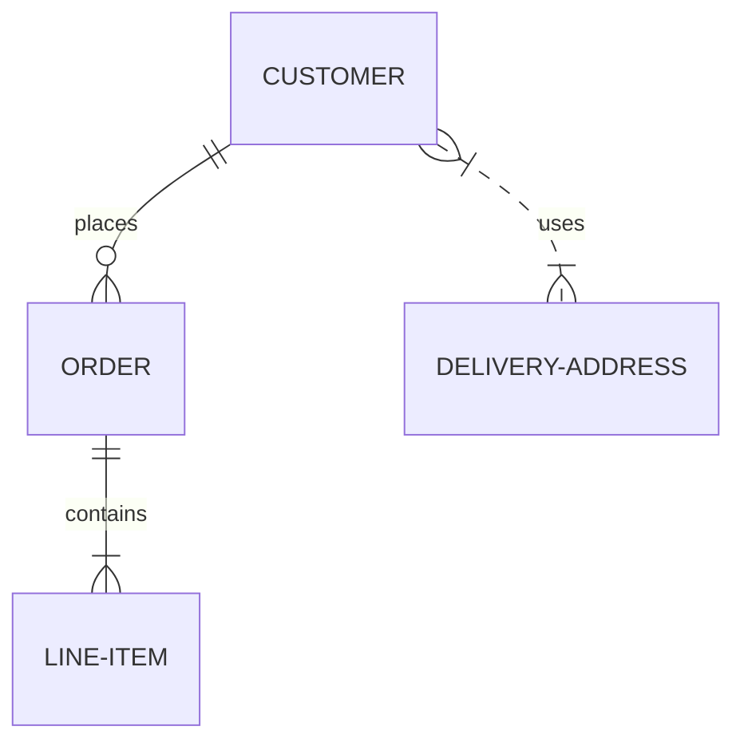

# Issue 70: ER diagram renders too large

## Problem

ER diagrams render at an excessively large scale -- the overall diagram dimensions are much bigger than necessary.

## Root Cause

Several factors contribute to oversized ER diagrams:

1. **Default layout spacing is too generous**: `LayoutConfig` defaults are `rank_sep=40.0` and `node_sep=30.0`, which are tuned for flowcharts with small nodes. ER entity boxes are already large (they contain attribute lists), so these spacings compound to produce excessive whitespace.

2. **Entity box sizing may be too wide**: `_CHAR_WIDTH = 8.0` in `src/merm/render/erdiag.py` and `_MIN_BOX_WIDTH = 100.0` may overestimate actual rendered text width, making boxes wider than needed.

3. **No ER-specific layout config**: `layout_er_diagram` in `src/merm/layout/erdiag.py` uses the default `LayoutConfig` when none is provided, rather than ER-tuned defaults with tighter spacing.

4. **Direction is always TB**: ER diagrams are conventionally laid out left-to-right (LR), which is more compact for typical entity-relationship chains. The current code hardcodes `Direction.TB`.

## Reproduction

## Expected

Diagram should render at a reasonable, compact size similar to mmdc output. Entity boxes should be appropriately sized for their content, and spacing between entities should be proportional.

## Dependencies

None.

## Acceptance Criteria

- [ ] The reproduction ER diagram renders with total SVG dimensions (width x height) that are reasonable -- no dimension exceeds 800px for this 3-entity diagram
- [ ] Entity box widths are proportional to their content (entity name + longest attribute text), not inflated by excessive char width estimates
- [ ] Spacing between entities is visually balanced -- not excessive whitespace
- [ ] ER layout uses tighter spacing defaults than generic flowchart layout (either a custom LayoutConfig or ER-specific defaults)
- [ ] Existing ER diagram tests continue to pass
- [ ] Render the reproduction diagram to PNG with cairosvg and visually verify the diagram looks compact and well-proportioned
- [ ] Compare output size against a simple baseline: the diagram should not be more than 2x larger (in total pixel area) than the sum of its entity box areas plus reasonable padding

## Test Scenarios

### Unit: ER diagram dimensions are reasonable

- Parse and layout the reproduction diagram
- Assert `layout.width < 800` and `layout.height < 800`
- Assert total area (width * height) is less than 400,000 sq px (roughly 630x630 or equivalent)
- Compare against entity box sizes: total whitespace should be less than 60% of total diagram area

### Unit: Entity box sizing is proportional to content

- Create an EREntity with id="CUSTOMER" and no attributes
- Measure its box size with `measure_er_entity_box`
- Assert width is less than 120px (short name, no long attributes)
- Create an EREntity with id="X" and no attributes
- Assert its width equals `_MIN_BOX_WIDTH` (100px)

### Unit: ER layout config uses tighter spacing

- Call `layout_er_diagram` with the reproduction diagram
- Verify the resulting layout uses ER-appropriate spacing (either by checking the config used or by measuring inter-entity gaps in the output)
- Inter-entity gap (edge-to-edge distance between adjacent entities) should be between 20-60px

### Integration: Full render roundtrip

- Render the reproduction diagram to SVG
- Parse the SVG viewBox dimensions
- Assert both width and height are under 800px
- Render to PNG with cairosvg
- Verify the PNG dimensions match expectations

### Regression: ER diagrams with attributes

- Parse and render an ER diagram with entities that have multiple attributes
- Verify entity boxes are tall enough to contain all attributes
- Verify the diagram still renders at a reasonable overall size

## PNG Verification Requirements

1. Render the reproduction diagram SVG to PNG using `cairosvg.svg2png(bytestring=svg.encode(), scale=2)`
2. Save to `.tmp/issue-70-er-diagram-size.png`
3. Visually confirm: entity boxes are compact and proportional to their content
4. Visually confirm: spacing between entities is reasonable (not excessive whitespace)
5. Visually confirm: the overall diagram does not look "zoomed out" or wastefully large
6. If possible, render the same diagram with mmdc and save to `.tmp/issue-70-er-mmdc-reference.png` for side-by-side comparison
