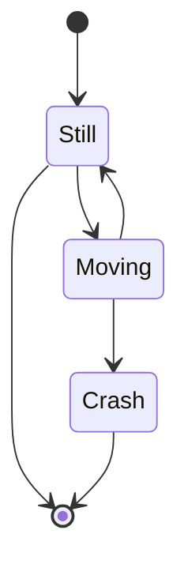

# Issue 88: Bidirectional edges overlap on same path

## Problem

When two nodes have edges in both directions (e.g., `Still --> Moving` and `Moving --> Still`), both edges are drawn on nearly the same path. The two arrowheads collide at each end, making them look blunt or merged. Users cannot visually distinguish that there are two separate edges.

Note: `apply_bidi_offsets` in `src/merm/render/edges.py` already exists and is called from both `svg.py` and `statediag.py`. The current offset (`_BIDI_OFFSET = 4.0px`) applies a perpendicular shift, but the visual result still shows overlapping arrowheads because:
1. The offset may be too small for the arrow marker size
2. The arrowhead markers are not adjusted for the offset -- they still point at the original endpoint
3. The path endpoints may need shortening so arrowheads don't overlap the node boundary at the same spot

Reproduction: state diagram with `Still --> Moving` and `Moving --> Still`.

## Expected

Bidirectional edges should be drawn as two clearly separated parallel paths, each with its own visible arrowhead. The two arrows should not visually merge or collide.

## Scope

- Fix bidirectional edge rendering so both arrows are clearly distinguishable
- Applies to all diagram types that call `apply_bidi_offsets` (flowchart via `svg.py`, state via `statediag.py`)
- Single-direction edges must remain unaffected (centered on the path)
- Do NOT change layout algorithm or node positioning

## Dependencies

None -- no other issues must be done first.

## Acceptance Criteria

- [ ] Bidirectional edges between two nodes are rendered as two visually distinct parallel paths
- [ ] Each arrowhead is clearly visible and sharp (no overlap/merging of arrow markers)
- [ ] The perpendicular offset between parallel paths is large enough to distinguish (minimum 6px visual separation between the two paths)
- [ ] Single-direction edges remain centered and unchanged
- [ ] The state diagram reproduction case (`Still <-> Moving`) renders with two clearly separate arrows
- [ ] Flowchart bidirectional edges (`A --> B` and `B --> A`) also render correctly
- [ ] All existing tests pass (`uv run pytest`)
- [ ] Render to PNG with cairosvg and visually verify that both arrowheads are distinct and not overlapping

## PNG Verification Checklist

### State diagram (primary reproduction case)
- Render: `stateDiagram-v2\n    [*] --> Still\n    Still --> [*]\n    Still --> Moving\n    Moving --> Still\n    Moving --> Crash\n    Crash --> [*]`
- Check: The Still-to-Moving and Moving-to-Still edges are clearly two separate parallel lines
- Check: Both arrowheads are sharp and point in their respective directions
- Check: The edges between Still and [*] (also bidirectional) are similarly separated
- Check: The single-direction edges (Moving --> Crash, Crash --> [*]) are unaffected

### Flowchart (cross-diagram verification)
- Render: `flowchart TD\n    A --> B\n    B --> A\n    A --> C`
- Check: A-to-B and B-to-A are two clearly separate parallel arrows
- Check: A-to-C is a single centered edge

### Edge case: horizontal layout
- Render: `flowchart LR\n    X --> Y\n    Y --> X`
- Check: Bidirectional offset works correctly for horizontal edges (offset should be vertical)

## Test Scenarios

### Unit: offset_edge_points
- Verify that offsetting a vertical edge produces horizontal displacement
- Verify that offsetting a horizontal edge produces vertical displacement
- Verify that offset magnitude matches the requested value

### Unit: find_bidirectional_pairs
- Two edges A->B and B->A: both pairs returned
- Single edge A->B only: empty set returned
- Three nodes with mixed edges: only the bidirectional pair is identified

### Unit: apply_bidi_offsets
- Bidirectional edges get offset applied (points differ from original)
- Single-direction edges remain unchanged
- The two directions of a bidirectional pair end up on opposite sides (y-coordinates or x-coordinates differ in opposite directions)

### Integration: SVG output verification
- Render the state diagram reproduction case, parse SVG, verify two distinct `<path>` elements exist for the Still-Moving edge pair with different `d` attributes
- Verify the path coordinates show clear separation (not within 1px of each other)

### Visual: PNG rendering
- Render state diagram to PNG, verify visually that bidirectional arrows are distinct
- Render flowchart to PNG, verify visually that bidirectional arrows are distinct
