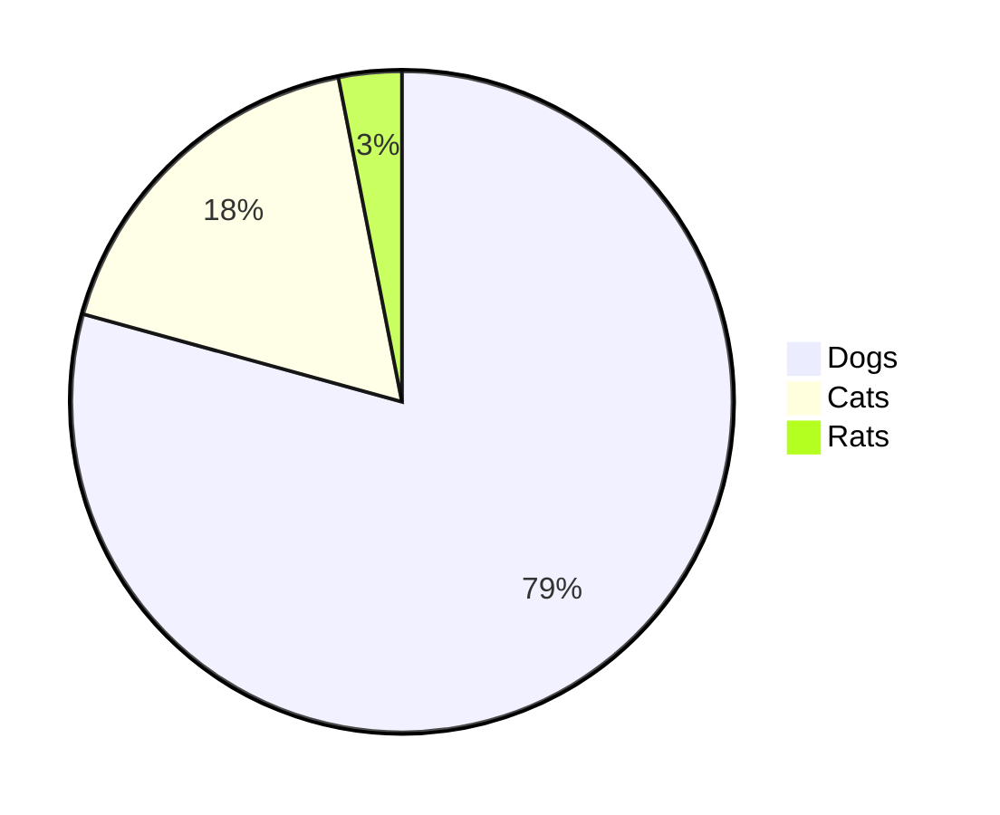

# Issue 89: Pie chart legend swatches show wrong color

## Problem

The color swatches in the pie chart legend are reported as showing all dark/black squares instead of matching the actual slice colors. The pie slices themselves are correctly colored.

**Investigation note (PM grooming):** When rendering the reproduction case with the current code, the SVG source shows correct `fill` attributes on legend `<rect>` elements, and the PNG renders with correct legend colors. This suggests the bug may be:
1. Environment-specific (different cairosvg version or CSS handling)
2. Triggered by specific CSS cascade conditions (the `class="pie-legend"` is shared between `<rect>` and `<text>` elements, and the CSS rule `.pie-legend` style block only targets `text.pie-legend`, which is correct -- but some renderers may handle this differently)
3. Related to a specific theme or configuration not tested here

The engineer should investigate whether there is a CSS specificity issue where a more general rule could override the inline `fill` attribute on rect elements, and ensure the fix is robust across renderers.

Reproduction:

## Expected

Each legend swatch rectangle should be filled with the same color as its corresponding pie slice.

## Scope

- Fix legend swatch colors in `src/merm/render/pie.py`
- Ensure CSS class names do not create ambiguity between rect and text legend elements
- All pie chart fixtures must render correctly
- Do NOT change pie slice colors, layout, or label positioning

## Dependencies

None -- no other issues must be done first.

## Acceptance Criteria

- [ ] Legend color swatch `<rect>` elements have distinct CSS class from legend `<text>` elements (e.g., `pie-legend-swatch` vs `pie-legend-text`) to avoid any CSS specificity conflicts
- [ ] Each legend swatch `fill` attribute matches the corresponding slice color (verified by parsing SVG)
- [ ] No CSS rule in the SVG `<style>` block can override the inline `fill` on legend rect elements
- [ ] All 6 pie chart corpus fixtures render correctly with matching legend colors
- [ ] The `show_data` variant includes data values in legend text and still has correct swatch colors
- [ ] Single-slice pie chart has a correct legend swatch color
- [ ] Pie chart with more than 10 slices wraps colors correctly in the legend (same as slices)
- [ ] All existing tests pass (`uv run pytest`)
- [ ] Render to PNG with cairosvg and visually verify legend swatch colors match slice colors

## PNG Verification Checklist

### Basic pie chart
- Render: `pie title Favorite Pets\n    "Dogs" : 386\n    "Cats" : 85.9\n    "Rats" : 15`
- Check: Three legend swatches show blue, red, olive (matching slices)
- Check: Legend text is readable and not overlapping swatches

### Many slices
- Render the `tests/fixtures/corpus/pie/many_slices.mmd` fixture
- Check: Each legend swatch matches its corresponding slice color
- Check: Colors cycle correctly if more than 10 slices

### Single slice
- Render the `tests/fixtures/corpus/pie/single_slice.mmd` fixture
- Check: Single legend swatch matches the circle fill color

### Show data variant
- Render the `tests/fixtures/corpus/pie/show_data.mmd` fixture
- Check: Legend swatches have correct colors AND legend text includes data values

## Test Scenarios

### Unit: CSS class separation
- Parse rendered SVG, verify legend `<rect>` elements do NOT share a CSS class with legend `<text>` elements
- Verify no CSS rule in `<style>` sets `fill` on legend rect elements (only inline `fill` should control rect color)

### Unit: Legend color matching
- For a 3-slice pie chart, extract `fill` attributes from both slice paths and legend rects
- Assert slice[i] fill == legend_rect[i] fill for all i

### Unit: Color cycling
- Create a pie chart with 12 slices (more than PIE_COLORS length)
- Verify legend rect colors cycle through PIE_COLORS with modulo

### Integration: All corpus fixtures
- Render all 6 pie chart fixtures from `tests/fixtures/corpus/pie/`
- For each, verify legend rect fills match slice fills

### Visual: PNG rendering
- Render basic pie chart to PNG, verify legend swatches visually match slice colors
- Render many-slices pie chart to PNG, verify all swatches are colored (not black)
