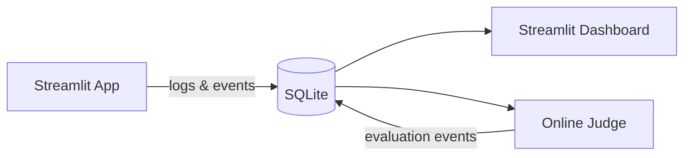

# Cylinder nodes: edge labels overlap node text in LR layouts

## Bug

When a flowchart has cylinder-shaped nodes (database) with edge labels, the labels overlap the cylinder node text. In LR layouts, the "logs & events" label sits directly on top of the cylinder's "SQLite" label. The "evaluation events" back-edge label also overlaps.

## Reproduction



## Root Cause Analysis

The issue is in `src/merm/render/edges.py`, function `resolve_label_positions`:

1. **Forward-edge labels never check against node bounding boxes.** Lines 470-473 explicitly restrict node-bbox collision avoidance to back-edge labels only:
   ```python
   if node_obstacle_bboxes and entries[i][0] in back_edge_keys:
   ```
   This means a forward-edge label placed at the edge midpoint can land on top of a node, and the nudging loop will not push it away.

2. **Edge midpoint falls inside target node in LR layouts.** With the default `rank_sep=40` and typical node widths (80-120px for cylinder nodes), the midpoint of a short 2-point edge in LR layout can be inside or very close to the target node. The label then overlaps the node text.

3. **Not cylinder-specific** -- this can happen with any node shape in LR layouts when the edge is short and has a label. Cylinders make it more visible because they are tall (extra space for ellipse caps: `4 * _CYL_RY = 40px` added to height).

## Proposed Fix

Extend the node-bbox collision check in `resolve_label_positions` to apply to **all** labeled edges (not just back-edges). The current restriction was added to "avoid destabilizing forward-edge labels" but that concern is outweighed by the label-on-node overlap bug.

Specifically, in `src/merm/render/edges.py` around line 470-473:
- Remove the `entries[i][0] in back_edge_keys` guard so all labels are checked against `node_obstacle_bboxes`.
- Possibly increase the `node_margin` (currently 4.0) to ensure labels have clear visual separation from nodes.

The existing nudging logic (push in the direction requiring least movement) should work correctly for forward-edge labels too.

## Dependencies

None -- this is a standalone bug fix.

## Acceptance Criteria

- [ ] `resolve_label_positions` checks all labeled edges (not just back-edges) against node bounding boxes
- [ ] In the reproduction diagram above, the "logs & events" label does not overlap the "SQLite" cylinder text
- [ ] In the reproduction diagram above, the "evaluation events" label does not overlap the "SQLite" cylinder text
- [ ] Edge labels have visible separation (at least 4px gap) from all node boundaries
- [ ] Existing tests pass: `uv run pytest` with no regressions
- [ ] Render the reproduction diagram to PNG with cairosvg and visually verify that no label overlaps any node text
- [ ] Render at least one additional LR flowchart with edge labels near non-cylinder nodes (e.g., rectangles, diamonds) to verify the fix does not break label placement for other shapes

## Test Scenarios

### Unit: resolve_label_positions nudges forward-edge labels away from nodes
- Create a mock LR layout where a forward-edge label midpoint falls inside a node bbox
- Call `resolve_label_positions` with `node_bboxes` provided
- Verify the returned label position does not overlap the node bbox (with margin)

### Unit: resolve_label_positions still nudges back-edge labels
- Verify existing back-edge label nudging behavior is preserved (no regression)

### Integration: cylinder LR diagram renders without label overlap
- Parse and render the reproduction diagram
- Extract label and node positions from SVG
- Assert no label bbox overlaps any node bbox

### Integration: non-cylinder LR diagram with edge labels
- Parse and render an LR flowchart with rectangular nodes and edge labels
- Verify labels are positioned in the gap between nodes, not on top of them

### Visual: PNG verification
- Render the reproduction diagram to SVG, convert to PNG with cairosvg
- Visually verify "logs & events" label is clearly between "App" and "SQLite" nodes
- Visually verify "evaluation events" label does not sit on top of "SQLite"
- Render a mixed-shape LR diagram (rectangles, diamonds, cylinders) and verify no label-node overlap
