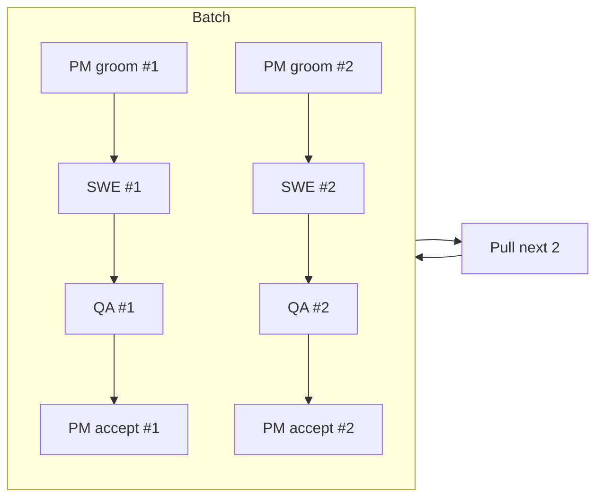

# GH#1: Edges to subgraph create duplicate node instead of connecting to subgraph boundary

## Bug

When a flowchart has edges referencing a subgraph ID (e.g. `Batch --> E`), merm creates a separate `<g class="node" data-node-id="Batch">` element (a small rectangle with the text "Batch") in addition to the `<g class="subgraph" data-subgraph-id="Batch">`. The edges connect to this duplicate node instead of pointing to/from the subgraph boundary.

This results in a broken diagram: a small "Batch" box appears (usually at the bottom) that should not exist, and the arrows do not connect to the subgraph.

## Reproduction

## Root Cause Analysis

The bug originates in the parser (`src/merm/parser/flowchart.py`), specifically in `_parse_node_edge_statement()`.

When the parser encounters `Batch --> E`, it tokenizes this into `["Batch", "-->", "E"]`. For each source/target token, it calls `_parse_node_def()` which treats `Batch` as a bare identifier and creates a `_NodeDef(id="Batch", label="Batch", shape=rect)`. Then `_register_node()` adds this to `state.nodes` because it does not check whether "Batch" is already declared as a subgraph ID.

**Result:** The final `Diagram` contains both:
- A `Node(id="Batch", label="Batch", shape=rect)` in `diagram.nodes`
- A `Subgraph(id="Batch", ...)` in `diagram.subgraphs`

The layout engine (`src/merm/layout/sugiyama.py`) then treats the Node "Batch" as a real graph node, assigns it position and size, and routes edges to/from it. The renderer creates both a `<g class="node">` and a `<g class="subgraph">` for the same ID.

**The fix must happen in two places:**

### Fix 1: Parser -- prevent creating nodes for subgraph IDs

In `_parse_node_edge_statement()` (or `_register_node()`), when processing edge endpoints, check if the node ID matches a known subgraph ID. If it does, do NOT create a Node for it. The edge should still reference the subgraph ID as source/target.

The set of known subgraph IDs can be collected from `state.subgraph_stack` (for subgraphs currently being parsed) and from `state.top_level_subgraphs` (for already-closed subgraphs). A helper like `_all_subgraph_ids(state)` that returns the set of all subgraph IDs would be clean.

### Fix 2: Layout -- route edges to/from subgraph boundary

The layout engine (`layout_diagram()` in `src/merm/layout/sugiyama.py`) currently builds its node list from `diagram.nodes` (line ~1559: `node_ids = [n.id for n in diagram.nodes]`). After Fix 1, edges may reference IDs that are not in `node_ids` (they are subgraph IDs instead).

The layout engine must:
1. Detect edges whose source or target is a subgraph ID (not a node ID)
2. For layout purposes, create a virtual/proxy node for the subgraph ID, sized to the subgraph bounding box
3. Route the edge to/from the subgraph boundary (the subgraph rect edge, not a point inside it)

**Simpler alternative for Fix 2:** Instead of proxy nodes, pick a representative "border node" inside the subgraph (e.g., the first or last node in the subgraph's node_ids depending on edge direction) and route the edge to that node. Then in the renderer, clip the edge path at the subgraph boundary rect. This is closer to how mermaid.js handles it.

**Simplest viable approach:** In the parser, when an edge references a subgraph ID, rewrite the edge endpoint to target a synthetic "border node" that gets placed at the subgraph boundary during layout. This avoids modifying the layout engine's core algorithm.

## Expected Behavior

- Edges referencing a subgraph ID connect visually to the subgraph boundary box
- No duplicate node is created for the subgraph ID
- The subgraph title and boundary box render normally
- Bidirectional edges to/from a subgraph (like the reproduction case) both connect to the boundary

## Dependencies

- None. This is a standalone bugfix.

## Acceptance Criteria

- [ ] `parse_flowchart()` does NOT create a `Node` in `diagram.nodes` for any ID that is also a subgraph ID
- [ ] Edges referencing a subgraph ID are preserved in `diagram.edges` (the edge source/target still references the subgraph ID or a synthetic proxy)
- [ ] The layout engine handles edges to/from subgraph IDs without crashing (no KeyError for missing node)
- [ ] The rendered SVG has exactly one `<g>` element for the subgraph ID (either `class="subgraph"` or the proxy approach), NOT both a node and a subgraph `<g>`
- [ ] No `<g class="node" data-node-id="Batch">` appears in the SVG output for the reproduction case
- [ ] The `<g class="subgraph" data-subgraph-id="Batch">` still renders with its rect and title text
- [ ] Edge paths visually connect to the subgraph boundary (arrow endpoints are on or near the subgraph rect)
- [ ] The reproduction case renders without errors: both `Batch --> E` and `E --> Batch` edges are present in the SVG
- [ ] Render the reproduction case to PNG with cairosvg and visually verify: arrows connect to the "Batch" subgraph box, no orphan "Batch" rectangle node exists
- [ ] All existing subgraph tests pass (`uv run pytest tests/test_subgraph.py tests/test_lr_subgraph_layout.py tests/test_subgraph_title_clipping.py`)
- [ ] All existing tests pass (`uv run pytest`)

## Test Scenarios

### Unit: Parser -- no duplicate node for subgraph IDs

- Parse the reproduction case; assert "Batch" is NOT in `[n.id for n in diagram.nodes]`
- Parse the reproduction case; assert "Batch" IS in `[sg.id for sg in diagram.subgraphs]`
- Parse the reproduction case; assert edges with source="Batch" or target="Batch" (or their proxy) exist in `diagram.edges`
- Parse a flowchart with a subgraph that has no external edges; assert subgraph renders normally (regression)

### Unit: Parser -- subgraph ID not registered as node even with shape syntax

- Parse `subgraph Batch ... end` then `Batch[Override] --> E`; assert "Batch" is not in nodes (the shape syntax on a subgraph ID should be ignored or raise an error)

### Unit: Layout -- edges to subgraph IDs

- Layout the reproduction case; assert no crash/KeyError
- Assert edge layouts exist for the Batch-to-E and E-to-Batch connections
- Assert edge endpoints are near the subgraph bounding box (not at some orphan node position)

### Integration: Full render pipeline

- Parse, layout, render the reproduction case to SVG
- Assert SVG is valid XML
- Assert no `data-node-id="Batch"` in the SVG
- Assert `data-subgraph-id="Batch"` exists in the SVG
- Assert at least 2 `<g class="edge">` elements connect to/from the Batch subgraph area
- Count total `<g class="node">` elements: should be 9 (A1, B1, C1, D1, A2, B2, C2, D2, E) not 10

### Visual: PNG verification

- Render the reproduction case SVG to PNG using cairosvg
- Visually verify: the "Batch" subgraph box contains 8 nodes in two rows, arrows from "Batch" box to "Pull next 2" and back, no orphan "Batch" rectangle

### Regression: existing subgraph features

- Run all tests in `tests/test_subgraph.py` -- all must pass
- Run `tests/test_lr_subgraph_layout.py` -- all must pass
- Run the full test suite -- no regressions

## Key Files

- `src/merm/parser/flowchart.py` -- `_register_node()`, `_parse_node_edge_statement()`, `_SubgraphBuilder`, `_ParserState`
- `src/merm/layout/sugiyama.py` -- `layout_diagram()`, `_collect_all_subgraph_node_ids()`
- `src/merm/render/svg.py` -- `render_svg()`, `_render_subgraph_recursive()`
- `src/merm/ir/types.py` -- `Node`, `Edge`, `Subgraph`, `Diagram` dataclasses
- `tests/test_subgraph.py` -- existing subgraph tests (especially `test_parse_edge_to_subgraph_id`)
