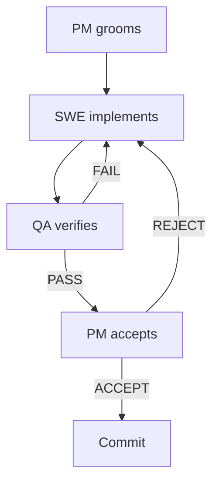

# GH#2: Edge labels overlap when multiple edges connect to the same node

## Bug

When rendering a flowchart where multiple edges point to the same node, the edge labels overlap each other and become unreadable. This is most visible with back-edges (edges that route upward) whose labels cluster in the same vertical region.

## Reproduction

## Root Cause Analysis

The label overlap resolution in `resolve_label_positions()` (in `src/merm/render/edges.py`) already implements iterative nudging to separate overlapping labels. However, the current algorithm has these weaknesses:

1. **Back-edge labels cluster in the same vertical zone.** When multiple back-edges target the same node (e.g., C->B "FAIL" and D->B "REJECT"), their midpoints are in similar x-ranges because the back-edge routing in `_route_edges()` (sugiyama.py line ~795) fans out attachment points but labels are computed from midpoints of the full polyline path, which converge to similar positions.

2. **Nudging only uses y-overlap vs x-overlap minimum.** The algorithm picks whichever axis has less overlap to nudge along. For back-edge labels that are stacked roughly vertically, small y-overlap gets nudged vertically by a tiny amount, insufficient to fully separate them.

3. **No awareness of node bounding boxes as obstacles.** Labels can be nudged into positions that overlap with node boxes, making them hard to read even when they do not overlap each other.

### Key Files

- `src/merm/render/edges.py` -- `resolve_label_positions()`, `_edge_midpoint()`, `_label_bbox()`, `_rects_overlap()`, `_render_edge_label()`
- `src/merm/layout/sugiyama.py` -- `_route_edges()` (back-edge fan-out at line ~795)
- `src/merm/render/svg.py` -- `render_svg()` orchestrates label position resolution (lines ~496-510)

## Expected Behavior

The FAIL, REJECT, PASS, and ACCEPT labels should all be clearly readable without overlapping each other. Back-edge labels (FAIL, REJECT) near the "SWE implements" node should be separated enough to be individually legible.

## Actual Behavior

The FAIL (from C to B) and REJECT (from D to B) labels cluster together near the "QA verifies" / "SWE implements" area and overlap or nearly overlap, making them hard to distinguish. PASS also crowds near REJECT.

## Implementation Guidance

### Approach 1: Improve nudging in `resolve_label_positions()`

The existing iterative nudging loop (20 passes, gap=6.0) needs improvement:

- **Increase the gap** between labels (e.g., 10-12px instead of 6px) so separated labels have more breathing room.
- **Ensure the nudge amount is sufficient.** Currently `y_overlap / 2.0` splits the nudge evenly. If one label is already well-positioned, it should stay put while the other moves more.
- **Add node bounding boxes as obstacles** (similar to how `obstacle_edges` already works). Pass node layouts into `resolve_label_positions()` so labels are not pushed on top of nodes.

### Approach 2: Spread back-edge label positions at the source

In `_route_edges()` the back-edge fan-out already spreads attachment x-coordinates by `_BACK_EDGE_FAN_SPACING = 12px`. The label midpoint computation could leverage this spread more aggressively -- e.g., bias the label position toward the unique part of each back-edge path rather than using the generic midpoint.

### Approach 3: Dedicated label slot allocation

For edges sharing a target node, pre-allocate label positions in a vertical stack near the target, evenly spaced, before the general nudging pass. This guarantees separation for the most common overlap case.

### Recommended

Combine Approach 1 (better nudging) with elements of Approach 3 (pre-stack labels sharing a target). The existing `resolve_label_positions()` architecture is sound; it just needs stronger separation logic.

## Acceptance Criteria

- [ ] `resolve_label_positions()` produces non-overlapping bounding boxes for all labeled edges in the reproduction case (C->D "PASS", C->B "FAIL", D->E "ACCEPT", D->B "REJECT")
- [ ] In the rendered SVG of the reproduction case, no pair of edge label background `<rect>` elements overlap (verified by parsing SVG and checking `_rects_overlap`)
- [ ] The FAIL and REJECT labels are separated by at least 8px vertical or horizontal gap in the rendered output
- [ ] The PASS label does not overlap with FAIL or REJECT labels
- [ ] Render the reproduction case to PNG with cairosvg and visually verify that all four labels (PASS, FAIL, ACCEPT, REJECT) are individually readable and do not overlap each other or node boxes
- [ ] Existing tests pass: `uv run pytest tests/test_edge_label_positioning.py tests/test_task53_edge_label_overlap_and_visibility.py` -- no regressions
- [ ] The fix does not break label positioning for diagrams without back-edges (e.g., simple `A -->|yes| B` still places the label at the edge midpoint)
- [ ] `uv run pytest` full suite passes

## Test Scenarios

### Unit: resolve_label_positions with reproduction-case-like edges

- Four labeled edges sharing two target nodes (B and D), with two back-edges to B. After `resolve_label_positions()`, all pairwise `_label_bbox` results must pass `not _rects_overlap`.
- Verify that the gap between the closest pair of label bounding boxes is at least 6px.

### Unit: resolve_label_positions preserves single-label midpoint

- A single labeled edge still gets its label at the exact midpoint (no regression from the fix).

### Unit: resolve_label_positions with three back-edges to the same node

- Three edges all targeting node B with labels "X", "Y", "Z". After resolution, all three label bounding boxes must be non-overlapping.

### Integration: reproduction case end-to-end

- Parse and render the full reproduction mermaid source. Extract all `<rect>` elements from edge-label groups. Assert no pairwise overlap.
- Assert all four expected labels (PASS, FAIL, ACCEPT, REJECT) are present in the SVG.

### Integration: simple diagram regression check

- Render `graph TD\n A -->|hello| B` and verify the label is at the edge midpoint (within 2px tolerance).

### Visual: PNG verification

- Render the reproduction case to PNG via cairosvg. Visually confirm all labels are readable and separated. Save PNG to `.tmp/` for review.

## Dependencies

- None. This is a standalone bug fix in the rendering/layout layer.
