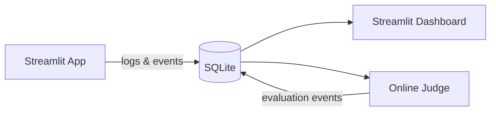

# Arrows don't touch node borders in LR layouts

## Bug

In LR flowcharts, arrows have visible gaps between the arrowhead and the node border. This is especially visible on:
- Diagonal edges (e.g., SQLite → Streamlit Dashboard going up-right)
- Edges to/from cylinder nodes
- Edges from diamond nodes (Decision → Result 1/2 in mermaid_readme)

Vertical arrows in TB layouts look fine — the issue is specific to diagonal/horizontal edges.

## Root Cause (investigated)

Three compounding issues:

### 1. Rectangular boundary approximation for non-rectangular shapes
`src/merm/layout/sugiyama.py` lines 626-653: `_boundary_point()` uses rectangular bbox for all shapes except diamonds. Cylinders (curved caps), circles, hexagons all get wrong boundary points on diagonal edges — the computed endpoint is inside the actual visual shape.

### 2. Uniform path shortening ignores angle
`src/merm/render/edges.py` lines 12-26: `_MARKER_SHORTEN_BY_ARROW` always shortens by 8px along the edge vector. On diagonal edges the visual effect is different than on vertical/horizontal ones. Combined with issue #1, this makes gaps worse.

### 3. Marker geometry mismatch
`src/merm/render/edges.py` lines 60-78: Marker has `refX="0"` (base at endpoint), tip extends 8px forward. The 8px shortening + 8px marker extension should cancel, but on diagonals the vector math doesn't perfectly align with the marker's visual extent.

## Reproduction

## Suggested fix

Fix #1 first (biggest impact): add shape-aware boundary calculation for cylinders (ellipse intersection) and circles (radius intersection) in `_boundary_point()`. Diamonds already have proper polygon intersection.

## Acceptance Criteria

- [ ] Arrows touch node borders for diagonal edges in LR layouts
- [ ] Arrows touch cylinder node borders
- [ ] Arrows touch diamond node borders
- [ ] No regression on TB layout arrows
- [ ] Existing tests pass
