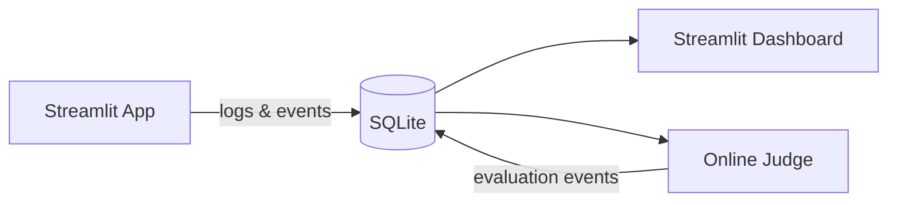

# Cylinder nodes: edge labels overlap node text in LR layouts

## Bug

When a flowchart has cylinder-shaped nodes (database) with edge labels, the labels overlap the cylinder node text. In LR layouts, the "logs & events" label sits directly on top of the cylinder's "SQLite"/"Postgres" label.

## Reproduction

## Expected behavior

Edge labels should be positioned clear of node labels. The "logs & events" label should sit between App and SQLite without overlapping either node's text.

## Acceptance Criteria

- [ ] Edge labels do not overlap cylinder node text
- [ ] Edge labels do not overlap any node text in LR layouts
- [ ] Existing tests pass
