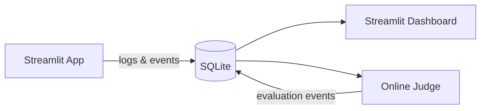

# Edge labels float away from their edge path

## Bug

In LR flowcharts with cylinder nodes, edge labels like "logs & events" float below/beside the diagram instead of sitting on the edge path between source and target.

## Root Cause (investigated)

Mermaid.js (dagre) treats edge labels as having width/height that **influences node spacing during layout** — dagre inflates rank separation to make room for labels. Labels then naturally sit at the path midpoint without overlap.

Our Sugiyama layout does **not** account for edge label dimensions when computing rank separation. This means:
1. Labeled edges end up too short (e.g., 32px vs dagre's 158px)
2. The label midpoint lands inside or very near a node
3. `resolve_label_positions()` pushes the label away to avoid overlap
4. Result: label floats far from its edge

Mermaid.js does NOT do any label-node overlap avoidance — it just puts labels at the path midpoint and uses a semi-transparent background.

## Suggested Fix

Inflate `effective_rank_sep` in `src/merm/layout/sugiyama.py` (around line 1763-1813) when edges have labels. The label width should be added to the minimum inter-rank distance so there's enough space for the label to sit on the edge.

This is the layout-level fix. The current `resolve_label_positions()` nudging would still serve as a safety net for edge cases.

## Reproduction

## Acceptance Criteria

- [ ] Layout inflates rank separation to accommodate edge label width
- [ ] Edge labels positioned at the midpoint of the rendered edge path
- [ ] Labels visually sit on or near their edge line
- [ ] No regression on TB layout labels or unlabeled edges
- [ ] Existing tests pass
