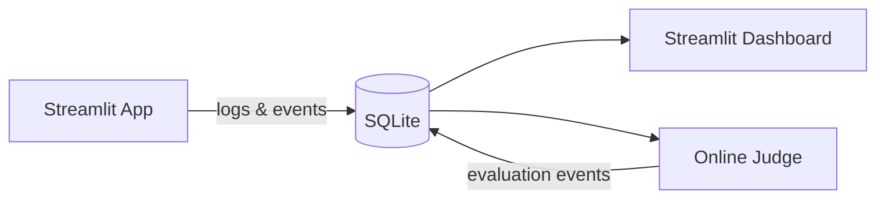

# Edge labels float away from their edge path

## Bug

In LR flowcharts with cylinder nodes, edge labels like "logs & events" float below/beside the diagram instead of sitting on the edge path between source and target. Labels should be positioned at the midpoint of the actual rendered edge path, like mermaid.js does.

## Reproduction

## Expected behavior

Labels should sit on or very near the edge path, centered at the edge midpoint. In mermaid.js, labels appear directly on the line connecting source and target.

## Acceptance Criteria

- [ ] Edge labels positioned at the midpoint of the rendered edge path
- [ ] Labels visually sit on or near their edge line
- [ ] No regression on TB layout labels
- [ ] Existing tests pass
