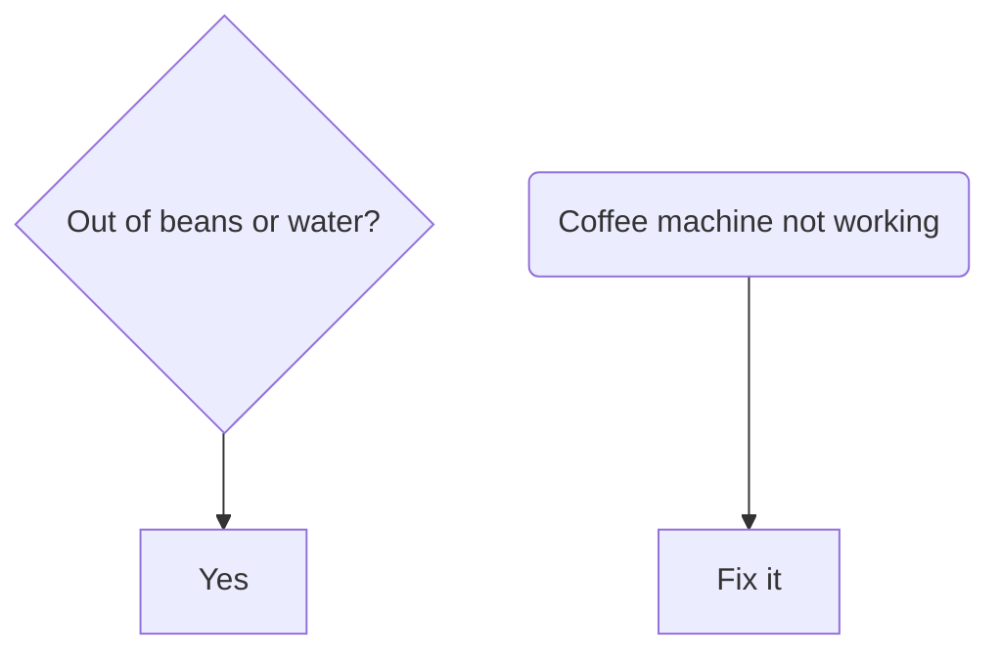

# Task 33: Fix Text Overflow in Diamond and Rounded Shapes

## Problem

Long text in diamond `{}` and rounded `()` shapes overflows outside the shape boundary. The shape is sized too small for the text, or the text is not properly centered within the shape.

### Reproduction

The diamond for "Out of beans or water?" renders as an empty diamond with text floating outside. The rounded rect for "Coffee machine not working" has text clipped at the edges.

### Root Cause

Diamond shapes size based on text width but don't account for the diagonal nature of the diamond — text needs much more horizontal space in a diamond than in a rectangle. Rounded shapes may not expand width enough for long text.

## Acceptance Criteria

- [ ] Diamond shapes auto-size to fully contain their label text with padding
- [ ] Rounded `()` shapes auto-size to contain their label text
- [ ] Text is horizontally and vertically centered within the shape
- [ ] No text overflows outside any shape boundary
- [ ] `uv run pytest` passes with no regressions

## Test Scenarios

### Unit: Diamond text containment
- Diamond with short text (e.g., "Yes?") — text fits inside
- Diamond with medium text (e.g., "Is it working?") — text fits inside
- Diamond with long text (e.g., "Out of beans or water?") — shape expands, text fits

### Unit: Rounded node text containment
- Rounded node with long text — shape width expands to fit
- Stadium shape with long text — shape width expands to fit

## Dependencies
- Task 32 (viewport clipping) — related but distinct issue
