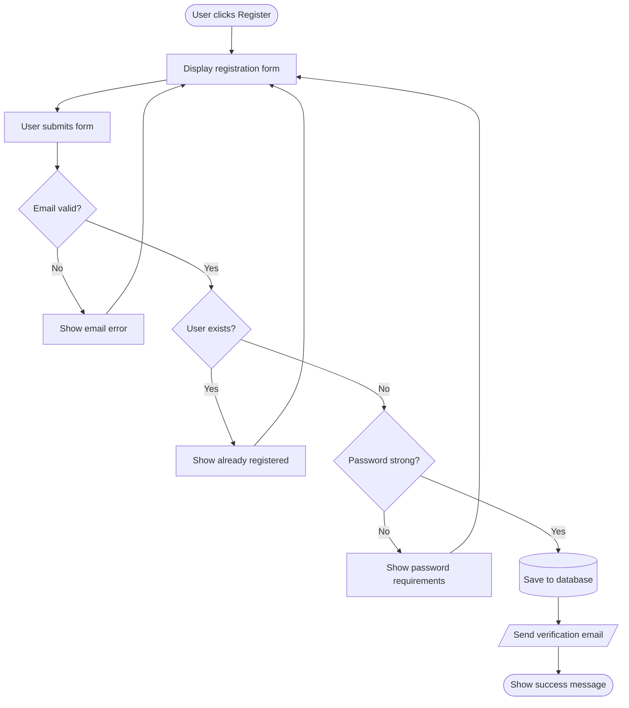

# Task 34: Fix Back-Edge Routing for Cycles and Multiple Return Edges

## Problem

When multiple edges go backwards (from a lower node to a higher node, creating cycles), the back-edge curves overlap and create a tangled mess. This is especially bad when multiple error paths return to the same node.

### Reproduction

Three edges (EmailError→Form, ExistsError→Form, PasswordError→Form) all go back up to "Form". They overlap into an unreadable bundle of curves on the right side.

### Root Cause

Back-edges (edges going against the flow direction) all route through the same channel with no horizontal separation. They need to be spread out so each curve is distinguishable.

## Acceptance Criteria

- [ ] Multiple back-edges to the same target node are visually separated (not overlapping)
- [ ] Each back-edge curve is individually traceable by the reader
- [ ] Back-edges don't cross through unrelated nodes
- [ ] The registration flow diagram renders with all 3 return-to-Form edges distinguishable
- [ ] `uv run pytest` passes with no regressions

## Test Scenarios

### Unit: Back-edge separation
- Graph with 2 back-edges to the same node — paths don't overlap
- Graph with 3 back-edges to the same node — paths are spread horizontally

### Visual: Registration flow
- Render the registration diagram, verify all return paths are separately traceable

## Dependencies
- None
