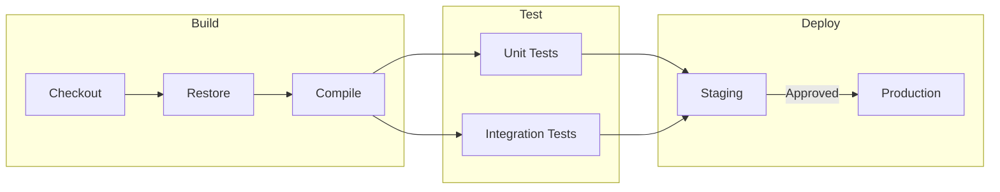

# Task 36: Fix LR Subgraph Layout (Overlapping Boundaries)

## Problem

In LR (left-to-right) flowcharts with multiple subgraphs, the subgraph boundaries overlap each other massively. Subgraphs should be laid out as separate visual regions, but instead they bleed into each other.

### Reproduction

"Build", "Test", and "Deploy" subgraphs overlap each other. The "Build" title is clipped. Nodes from different subgraphs are not visually separated by their boundaries.

### Root Cause

The Sugiyama layout doesn't constrain sibling subgraphs to non-overlapping regions in LR mode. Subgraph boundary boxes are computed from child node positions but don't account for the space needed between adjacent subgroups. The coordinate transform from TB to LR may also scramble the subgraph boundaries.

## Acceptance Criteria

- [ ] Sibling subgraphs in LR layout do not overlap each other
- [ ] Each subgraph boundary fully contains its child nodes
- [ ] Subgraph titles are fully visible and not clipped
- [ ] Cross-subgraph edges route cleanly between the boundaries
- [ ] The CI pipeline diagram renders with 3 visually distinct, non-overlapping subgraph regions
- [ ] `uv run pytest` passes with no regressions

## Test Scenarios

### Unit: LR subgraph separation
- Render LR diagram with 2 sibling subgraphs, verify boundaries don't overlap (no x-range intersection)
- Render LR diagram with 3 sibling subgraphs, verify all titles are fully within boundaries

### Visual: CI pipeline
- "Build", "Test", "Deploy" are 3 distinct regions from left to right
- All edges between subgraphs are visible

## Dependencies
- Task 27 (subgraph boundary rendering) — general subgraph fixes may help
- Task 26 (LR layout) — done, edges now render in LR
