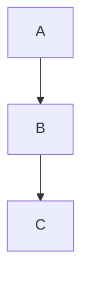

# Task 37: Fix Arrow-to-Node Connection (Gap and Penetration)

## Problem

Arrows connect directly to node boundaries with no visual gap. The edge path starts exactly at the source node's border and ends exactly at the target node's border. Combined with the arrowhead marker's `refX` placement, the arrowhead tip actually penetrates into the target node rather than pointing at it with a small gap.

### Specific Issues

1. **No gap at target**: The arrowhead tip should stop ~2-3px before the node border, not touch or penetrate it
2. **No gap at source**: The edge line starts flush with the source node border — mermaid.js leaves a tiny gap
3. **refX miscalculation**: The arrow marker has `refX="5"` (midpoint of the 10-unit viewBox) but with `markerWidth="8"`, the tip of the triangle (`L 10 5`) maps to ~8px past the path endpoint, meaning the arrowhead overshoots into the node

### Reproduction

Edges go from y=54 (node A bottom) to y=104 (node B top) with zero gap. Arrowhead penetrates into node B.

**Also affects circle endpoints** (`docs/comparisons/edges/circle_endpoint_pymermaid.svg`): the circle marker sits right on top of the node border, partially overlapping it. Cross endpoints have the same issue.

**Also affects BT direction** (`docs/comparisons/direction/bt_pymermaid.svg`): upward-pointing arrows have the same penetration issue — arrowhead tips touch/overlap the target node bottom border. This confirms the problem is in all 4 directions (TD, BT, LR, RL), not just TD.

### How mermaid.js does it

In mermaid.js, the edge endpoint is offset inward by the marker size so the arrowhead tip lands exactly at the node border. The `refX` is set to match the arrowhead tip (refX=10 for a 10-unit triangle pointing right), and the path endpoint is shortened by the marker size.

## Acceptance Criteria

- [ ] Arrowhead tip stops at or just before the target node border (not inside it)
- [ ] Edge line starts with a small gap (~2px) from the source node border
- [ ] The `refX` value on arrow markers correctly aligns the tip with the path endpoint
- [ ] Circle-end and cross-end markers also have correct refX alignment
- [ ] Works correctly for all directions (TD, LR, RL, BT)
- [ ] Works for diagonal edges (not just straight vertical/horizontal)
- [ ] `uv run pytest` passes with no regressions

## Test Scenarios

### Unit: Edge endpoint offset
- Render A-->B in TD, verify edge path end y < node B top y (gap exists)
- Render A-->B in LR, verify edge path end x < node B left x

### Unit: Marker refX
- Arrow marker refX should align triangle tip with the path endpoint
- Circle-end marker refX should place circle edge at path endpoint

### Visual: Clean arrow connections
- Render 3-node chain, verify arrowheads don't penetrate nodes

## Dependencies
- None
